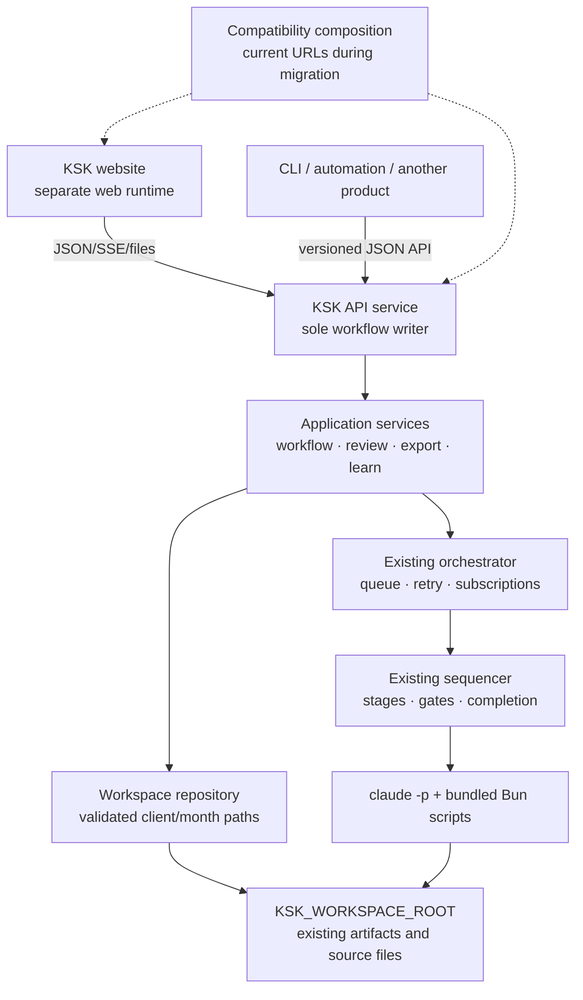

# KSK workflow API-service separation plan

> **Superseded on 2026-08-06.** This document records the earlier separate-service
> direction. The authoritative plan is now
> `docs/plans/2026-08-06-keying-core-modular-monolith-plan.md`, where Task/Job management,
> the workflow queue, monitoring, orchestrator, SQLite, CLI, private HTTP, and SSE belong
> to one deployable **Keying Core** modular monolith.

Status: superseded
Date: 2026-08-06
Target branch inspected: `origin/main` at `1a51d4d` (the change from local
`main@b3b8315` only updates `platform-mock-p0`; the console and workflow files analyzed by
this plan are unchanged)
Companion architecture: `docs/plans/2026-08-06-single-host-task-manager-workflow-architecture.md`

## Outcome

Separate the workflow runtime from the website so the workflow can run as an API-only
service, while preserving the current website during migration.

The separation must not change:

- the client/month input layout;
- the stage order, retry policy, gates, or completion rules;
- the `claude -p /ksk-stage-<id> <monthPath>` stage invocation contract;
- any existing artifact path or schema;
- the existing `/api/*`, `/files/*`, and browser URL behavior during the compatibility
  period;
- PEAK export row generation, filenames, workbook bytes, or the `changes.json` side
  effect.

This is an extraction and adapter project, not a pipeline rewrite.

## Current state

The code is internally modular but deployed as one process:

1. `console/sequencer/logic.ts` is the workflow state machine. Its process, gate, and
   human-stop boundaries are dependency-injected.
2. `console/app/orchestrator.ts` owns the in-memory queue, concurrency, run lifecycle,
   persistence, and subscriptions.
3. `console/app/server.ts` boots the orchestrator and then serves both `/api/*` and all
   server-rendered website routes from one `Bun.serve()` handler.
4. Review pages call filesystem-backed modules directly on the server. The website uses
   API routes for actions, but the public API does not yet expose every review read model.
5. `/api/clients` and `/api/events` include pre-rendered HTML, so those payloads are
   website-specific rather than a neutral service contract.

## Target topology

The API service is the only process allowed to mutate client data or run state. The web
runtime becomes a client of the API; it must not keep a second independent orchestrator or
write the mounted workspace directly.

## Compatibility contract

### Inputs that must remain unchanged

| Input | Current pointer | Required behavior after separation |
|---|---|---|
| Workspace root | `KSK_WORKSPACE_ROOT` | Still required, resolved to an existing directory at API-service boot. |
| Client/month identity | `<workspace>/<client>/<month>` and POSIX `client/month` | Still exactly two levels. The canonical external identifier remains the workspace-relative `relPath`. |
| Start-run request | `POST /api/runs` with `{ "path": "<client>/<month>" }` | Preserve method, body, validation, status codes, and response during compatibility. |
| Client context | `<client>/CLIENT.md`, `<client>/coa.csv`, optional `<client>/coa_usage.json` | Preserve lookup order: the run root first for legacy/self-contained fixtures, then its parent client root. |
| Month source documents | Directly inside or below `<client>/<month>/` | Inventory inclusion/exclusion rules remain owned by the existing scripts. Do not reimplement them in the API. |
| Generated-directory exclusions | `ข้อมูลระบบ/`, `ตรวจทาน/`, legacy `_segments/`, `_doc_groups/`, `_pages/` | Preserve `paths.ts` as the source of truth. |
| Stage invocation | `claude -p /ksk-stage-<id> <absolute-month-path>` | Preserve prompt, cwd, model, permission mode, hooks, deadlines, and process-supervisor behavior. |
| Runtime configuration | Existing `KSK_APP_*`, `KSK_STAGE_*`, `KSK_GATE_*`, and `KSK_INTERPRET_*` variables | Preserve existing names and defaults. New API/web variables must be additive. |

### Filesystem outputs that must remain unchanged

| Scope | Existing pointer | Ownership/invariant |
|---|---|---|
| Client | `<client>/CLIENT.md` | Stage profile and documented profile updates; same format and location. |
| Client | `<client>/coa.csv` | Same COA input/output and fallback behavior. |
| Client | `<client>/coa_usage.json` | Still written only by confirmed learning apply. |
| Client | `<client>/learning-notes.md` | Preserve append/update semantics from the learning flow. |
| Month/pages | `<month>/ข้อมูลระบบ/_pages/run-state.yaml` | Same `ksk_run_state.v1` schema and atomic temp-file/rename write. No new central run database in this project. |
| Month/pages | `<month>/ข้อมูลระบบ/_pages/inventory.yaml` | Same deterministic inventory denominator. |
| Month/pages | `<month>/ข้อมูลระบบ/_pages/{fragments,claim-audit}/**` | Same Stage-2 evidence layout. |
| Month/pages | `<month>/ข้อมูลระบบ/_pages/dispositions.yaml` | Same writer protections and human/agent declarations. |
| Month/pages | `<month>/ข้อมูลระบบ/_pages/ledger.yaml` | Still derived only by the ledger script; never maintained by the service. |
| Month/pages | `<month>/ข้อมูลระบบ/_pages/{build-review-data-stale,segments-manifest,segments-manifest-history,human-stop}.yaml` | Preserve gate, staleness, immutability, audit, and stop semantics. |
| Month/segments | `<month>/ข้อมูลระบบ/_segments/manifest.yaml`, `SUMMARY.md`, and `<segment>/*.json` | Same schemas, IDs, and paths. |
| Month/groups | `<month>/ข้อมูลระบบ/_doc_groups/links.draft.yaml`, `links.yaml`, `manifest.yaml`, and bucket/group JSON | Same category/VAT tree and `interpretation.json`, `categorize.json`, `review-data*.json`, `changes.json` behavior. |
| Human review | `<month>/ตรวจทาน/**` | Existing static review artifacts remain valid and are not renamed, even if the separated website renders review pages through HTTP. |
| Export | Existing PEAK filename, headers, rows, workbook bytes, warnings, and per-group `changes.json` write | Legacy endpoint keeps its current response shape. A new binary endpoint may be additive only. |

`console/.claude/skills/ksk-keying/scripts/paths.ts` (deployed as
`.claude/skills/ksk-keying/scripts/paths.ts`) remains authoritative for the Thai and
machinery directory layout. The API must consume that path policy or a shared equivalent;
it must not create a competing folder map.

## Proposed module boundaries

The first implementation should extract seams without immediately moving every existing
file. Suggested ownership:

| Boundary | Proposed location | Responsibility | Must not know about |
|---|---|---|---|
| Sequencer core | existing `console/sequencer/*` | Stage order, transition rules, gate results, process supervision | HTTP, HTML, browser state |
| Run orchestration | existing `console/app/orchestrator.ts` initially | Queue, concurrency, retries, cancellation, persisted state, events | HTTP request/response and rendered HTML |
| Workspace locator/repository | `console/service/workspace-repository.ts` | Canonical `client/month` parsing, containment checks, artifact reads, atomic write helpers | HTML |
| Workflow service | `console/service/workflow-service.ts` | Start/list/get/retry/repair/stop and lifecycle policies over the orchestrator | HTTP status codes and Thai presentation strings |
| Review service | `console/service/review-service.ts` | Hub/bucket/claim read models and guarded edits | HTML rendering |
| Export service | `console/service/export-service.ts` | Build PEAK bytes and `changes.json` side effects as one application operation | HTTP encoding/download mechanics |
| Learn service | `console/service/learn-service.ts` | Propose/review/apply and client-level exclusion against active runs | Dialog rendering |
| API adapter | `console/http/api-router.ts`, `console/http/contracts.ts` | Decode requests, validate DTOs, map service errors to HTTP, JSON/SSE/file responses | Direct workspace joins and HTML rendering |
| API entrypoint | `console/api/server.ts` | Config, service composition, `Bun.serve`, shutdown | Website routes |
| Website adapter | `console/web/*` | Render the current pages from API read models and call API actions | Direct workflow spawning or workspace writes |
| Combined compatibility entrypoint | existing `console/app/server.ts` during migration | Compose the API router and website router under current URLs | New business rules |

Service methods should return typed success/error results using stable machine codes such
as `run_not_found`, `run_not_retryable`, and `workspace_path_invalid`. The legacy HTTP
adapter maps those codes back to the current status codes and Thai messages so its output
does not change.

## HTTP contract strategy

### Preserve the existing surface

Keep these current routes operational and behavior-compatible throughout rollout:

- `GET /api/config`, `GET /api/clients`;
- `GET /api/events`, `GET /api/runs/:client/:month/events`;
- `GET/POST /api/runs` and existing run-control subroutes;
- claims, learning, review-edit, export, and `/files/*` routes;
- `/` and `/clients/:client/:month/**` website URLs during the compatibility period.

The existing HTML-bearing `/api/clients` and `/api/events` payloads remain as legacy
website contracts. Do not silently redefine them as neutral JSON.

### Add a neutral, versioned surface

Add `/v1` alongside—not instead of—the existing routes:

| Resource | Proposed API | Notes |
|---|---|---|
| Workspace listing | `GET /v1/clients` | Data only; no rendered HTML. |
| Runs | `POST /v1/runs`, `GET /v1/runs`, `GET /v1/runs/:client/:month` | Use the same `client/month` identity and orchestrator. |
| Run events | `GET /v1/runs/:client/:month/events` | Raw typed run events over SSE; no HTML fragments. |
| Run actions | `POST /v1/runs/:client/:month/actions/{retry,repair,stop}` | Same state-machine permissions as today. |
| Review hub | `GET /v1/review/:client/:month` | JSON form of existing `loadHubStats` output. |
| Review buckets | `GET /v1/review/:client/:month/buckets/:bucket` | Pages/statements, COA choices, guard state, and source references. |
| Exclusion claims | `GET /v1/review/:client/:month/claims` | JSON form of current claim construction. |
| Review edits | `PATCH /v1/review/...` | Typed payloads; optional optimistic revision. Existing `POST /api/review/...` stays. |
| Export | `POST /v1/exports/...` | Prefer an XLSX response with `Content-Disposition`; keep legacy base64 JSON unchanged. |
| Learning | `POST /v1/clients/:client/learning/proposal` and `/apply` | Preserve client-wide scan and active-run exclusion. |
| Source files | `GET /v1/files/:client/:month/*` | Reuse one traversal-safe resolver and content-type policy. |

Document the current implementation reality before publishing it as a contract: for
example, the legacy export implementation currently accepts `POST` although the README
lists `GET`, and review-edit implementation currently accepts `POST`. Correct the
documentation without changing working clients in the separation PRs.

## Consistency controls

1. **One writer process.** Only the API service boots `orchestrator` and receives a
   read-write workspace mount. The website receives no Claude credentials and no
   read-write client mount.
2. **One canonical path resolver.** Decode once, require exactly `client/month` where
   appropriate, resolve under `KSK_WORKSPACE_ROOT`, and pass an opaque located target to
   services. No route may use decoded URL components in a raw `join()`.
3. **Preserve atomic filesystem writes.** Keep temp-file-then-rename for `run-state.yaml`,
   dispositions, and review data. Centralize the helper only after characterization tests
   prove byte/permission behavior.
4. **Serialize conflicting mutations.** Introduce an in-process lock keyed by canonical
   client-month for review edits, claims, rebuild, export side effects, and repair. Keep the
   existing rule that an active/queued run rejects review mutations. Use a client-level
   lock for learning apply because it changes input shared by all months.
5. **Keep gates authoritative.** HTTP success means the command was accepted or the edit
   was written; workflow completion still means `logic.ts` advanced only after the real
   completion check exited zero.
6. **Separate raw events from rendering.** Application events contain IDs, state, progress,
   and revisions. Only the website adapter turns them into HTML. Preserve the existing
   HTML SSE stream until the current dashboard has migrated.
7. **Protect against lost review edits.** New `/v1` review resources should return a
   revision derived from the loaded file and accept optional `If-Match`. The existing
   legacy route remains behavior-compatible; the separated website adopts revisions
   before the compatibility route is retired.
8. **Single-replica invariant.** Initial API deployment remains one process per workspace.
   Fail deployment validation if multiple API replicas share the same mount. Distributed
   locking and a central queue are explicitly out of scope for this extraction.
9. **Idempotency where retries are plausible.** New start/action/apply endpoints accept an
   optional idempotency key. Existing route semantics and 409 behavior remain unchanged.
10. **Authenticated exposure.** Preserve loopback as the bare-host default and Cloudflare
    Access as the current Docker boundary. If the API is exposed outside that boundary,
    service authentication is required before cutover.

## Implementation sequence

### Phase 0 — freeze and characterize contracts

Changes:

- add a checked-in contract inventory for routes, environment variables, stage commands,
  schemas, and all paths listed above;
- add request/response characterization tests around the existing handlers;
- add golden workspace-tree fixtures for run-state, review edits, claims, rebuild, learning,
  and export side effects;
- add explicit traversal tests for every client, month, group, and wildcard path parameter;
- record the current legacy method mismatch in documentation.

Exit criteria:

- current tests remain green;
- a machine-readable compatibility suite can fail on a route, status, payload, path, schema,
  or output-tree change;
- no production behavior has changed.

### Phase 1 — establish the application-service seam

Changes:

- introduce the workspace repository and typed service errors;
- lift run-control operations out of `server.ts` into `workflow-service`;
- lift review, claims, export, rebuild, and learning orchestration into dedicated services;
- keep existing rendering modules and routes calling those services in-process.

Exit criteria:

- `server.ts` contains request parsing/routing and rendering composition, not workflow rules;
- all legacy contract and filesystem golden tests match;
- `console/sequencer/*` behavior and stage commands are untouched.

### Phase 2 — extract and test the HTTP adapters

Changes:

- create a dependency-injected legacy API router from the existing `/api/*` blocks;
- centralize URL decoding, exact-segment validation, containment checks, and error mapping;
- make the router importable without calling `Bun.serve()` or booting the orchestrator;
- keep the current combined entrypoint composing this router plus website routes.

Exit criteria:

- route integration tests exercise actual `Request -> Response` behavior;
- existing browser JS needs no changes;
- all unsafe/unchecked direct path joins have been removed from HTTP adapters.

### Phase 3 — add the API-only runtime and `/v1` contract

Changes:

- add `console/api/server.ts` as the sole orchestrator-owning entrypoint;
- add data-only `/v1` clients, runs, events, review, claims, edits, export, files, and learning
  routes;
- add readiness/liveness endpoints that distinguish “HTTP alive” from “workspace/Claude
  prerequisites ready”;
- add API contract documentation and examples using the same `client/month` pointers.

Exit criteria:

- a headless client can complete start -> monitor -> inspect review -> edit/decide -> export
  without an HTML route;
- API-only mode produces the same workspace tree and PEAK output as the combined app;
- existing `/api/*` remains green.

### Phase 4 — make the website an API client

Migrate one vertical slice at a time:

1. dashboard listing and run events;
2. run actions;
3. review hub;
4. exclusion claims;
5. document review;
6. bank-statement review;
7. export and learning.

For each slice, switch reads and writes together so one page never mixes two sources of
truth. Preserve the current browser URLs and rendered appearance. The website may stay
server-rendered; separation does not require adopting a frontend framework.

Exit criteria:

- website runtime has no orchestrator import, Claude credential, or read-write workspace
  access;
- all user actions travel through `/v1`;
- website and direct API clients observe the same run revisions and review state.

### Phase 5 — deployment cutover and compatibility retirement

Changes:

- deploy one API service with the read-write workspace and Claude/skill mounts;
- deploy the website separately with only API connectivity;
- route current public URLs through the web service and `/v1` through the API service;
- retain the combined entrypoint as a rollback path for one release window;
- deprecate—not immediately delete—the legacy HTML-bearing API endpoints.

Exit criteria:

- canary client-month runs and exports match the pre-separation baseline;
- restart/resume, stop, repair, blocked, fatal-cleanup, and human-stop cases pass;
- rollback to the combined entrypoint requires no workspace migration;
- logs identify API request ID, canonical client/month, run revision, stage, and write target
  without logging document contents or credentials.

## Verification matrix

| Area | Required proof |
|---|---|
| State machine | Existing `logic.test.ts` transition/retry/final-gate suite passes unchanged. |
| Queue/lifecycle | Existing `orchestrator.test.ts` concurrency, resume, cancellation, repair, subscription, and fatal-cleanup suite passes unchanged. |
| Route compatibility | Golden method/path/status/header/body tests for every legacy route before and after extraction. |
| Folder compatibility | Compare recursive relative path lists before/after each scenario; no renamed or relocated files. |
| Schema compatibility | Parse and compare `schema` values plus semantic content for YAML/JSON artifacts. Normalize only documented volatile timestamps in test assertions. |
| Byte compatibility | Compare exported XLSX bytes and filenames from the same reviewed fixture. |
| Side-effect compatibility | Compare `review-data.json`, dispositions, `changes.json`, `coa_usage.json`, and `learning-notes.md` after identical actions. |
| Restart safety | Stop the API between persisted transitions, restart, and prove only `idle` records resume automatically. |
| Concurrency safety | Concurrent edits to one group are serialized; stale `/v1` revisions fail without overwriting newer work. Different client-months retain configured run concurrency. |
| Path safety | Encoded traversal in client, month, group, and file wildcard is rejected before any filesystem access. Valid Thai, spaces, and Unicode identifiers still work. |
| Website parity | Browser tests cover the same dashboard, review, claim, edit, export, and learning flows against the separated API. |
| No-AI extraction tests | Most migration tests use fake stage runners and existing fixtures; no paid Claude run is needed for ordinary CI. |
| Final canary | One approved, blind client-month canary runs through real stages and gates, then compares its artifact tree and export against the compatibility baseline. |

## PR breakdown and rollback boundaries

1. **Contract freeze and security characterization** — tests/docs only; zero runtime change.
2. **Workspace repository and service error model** — legacy routes still call in-process.
3. **Workflow/review/export/learn service extraction** — no new endpoints.
4. **Importable legacy API router and centralized path validation** — combined server remains default.
5. **API-only entrypoint and data-only `/v1` reads/events** — additive deployment.
6. **`/v1` mutations, export, idempotency, and revision control** — legacy endpoints retained.
7. **Website migration by vertical slice** — each slice independently reversible.
8. **Separate deployment cutover, observability, and compatibility deprecation notice**.

Every PR must be independently releasable. No PR may require moving an existing client
folder or rewriting an existing artifact before the next PR can run.

## Risks and decisions

### Recommended decisions

- Build two real entrypoints (`api` and `web`) plus a temporary combined compatibility
  entrypoint. An “API-only flag” inside the current server is useful for smoke testing but
  is not sufficient separation by itself.
- Add `/v1` rather than cleaning up `/api/*` in place. Existing HTML-bearing payloads are
  part of the website’s current behavior.
- Keep filesystem-backed run state for this project. A database migration would combine two
  high-risk changes and is unnecessary for a single-workspace, single-writer service.
- Keep server-rendered HTML unless there is a separate product reason to change frontend
  technology.
- Stream XLSX from the new export endpoint, but preserve the existing base64 JSON export
  until legacy clients are retired.

### Risks to control

- **Split-brain writers:** the largest risk if both old and new processes boot an
  orchestrator against the same mount. Deployment and startup rules must make this
  impossible.
- **Path-policy drift:** app code currently has local path joins in addition to script-level
  `paths.ts`. Extraction must converge on one validated locator without changing legal
  Thai/Unicode paths.
- **False compatibility from shallow tests:** comparing only HTTP success is insufficient;
  the workspace tree and generated workbook must also match.
- **Event-order regressions:** current dashboard SSE has sequence safeguards. Raw `/v1`
  events need monotonic run revisions, and the legacy HTML stream must retain its current
  ordering behavior until migration.
- **Review write races:** separation increases the chance of multiple clients editing the
  same group. Serialization plus optional revisions should land before the website and API
  are both active clients.
- **Security boundary expansion:** the current app assumes loopback or Cloudflare Access.
  Do not call the API “public” until authentication, traversal tests, request limits, and
  cost controls match the intended exposure.

## Definition of done

The separation is complete when:

1. the API service can run with no website routes or renderer imports;
2. the website can run with no orchestrator import, Claude credentials, or writable
   workspace mount;
3. a direct API client can perform the complete workflow, including review and export;
4. all existing input pointers, artifact paths, schemas, stage/gate behavior, legacy routes,
   and PEAK outputs pass the compatibility suite;
5. only one API process owns writes for a workspace;
6. deployment can roll back to the combined app without moving or converting client data.
