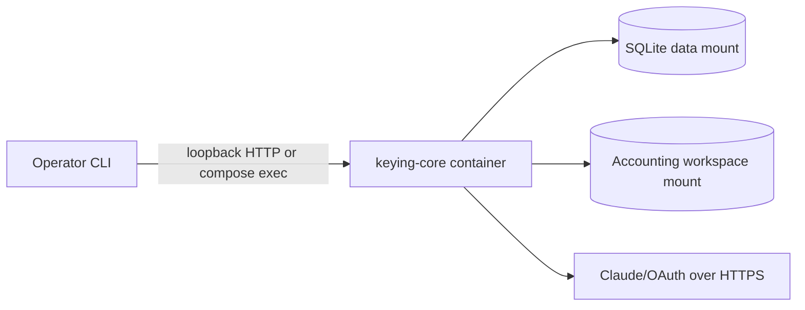
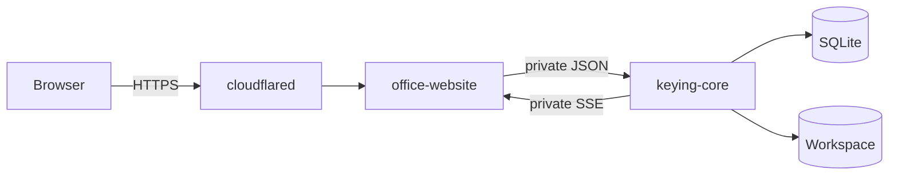
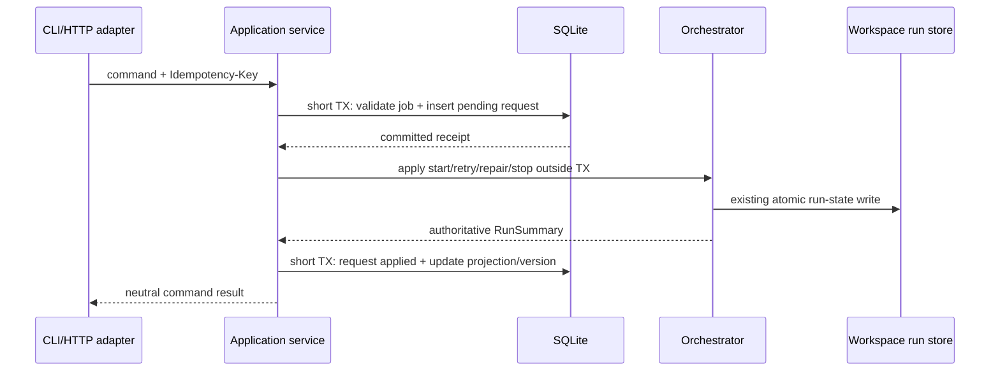

# Keying Core modular-monolith implementation plan

Status: proposed — authoritative plan
Date: 2026-08-06
Planning branch: `plan/keying-core-modular-monolith`
Baseline inspected: `origin/main@488220e`
Supersedes:

- `docs/plans/2026-08-06-api-service-separation-plan.md`
- `docs/plans/2026-08-06-single-host-task-manager-workflow-architecture.md`

## 1. Outcome

Build one deployable application named **Keying Core**. It combines keying-job
management with the existing workflow scheduler, queue, monitor, orchestrator, review
operations, and workspace integration.

Keying Core is a modular monolith, not a set of networked Task Manager and Workflow
services. CLI, private HTTP, SSE, the current website during migration, and a future
office-wide website are adapters around the same application commands, queries, and
events.

Initial production shape:

- one Linux host;
- one `keying-core` process/container;
- embedded SQLite for job metadata and durable command receipts;
- existing workspace files for authoritative workflow/run state and artifacts;
- concurrency defaults to one;
- no new UI is required;
- no PostgreSQL, Redis, RabbitMQ, or separate worker container;
- no public Keying Core API.

This is an extraction and interface project. It is not a pipeline rewrite.

## 2. Terminology and ownership

| Term | Meaning | Owner |
|---|---|---|
| Keying Core | The single deployable backend application | This repository |
| Keying job | A manageable unit bound to one workspace-relative client/month | SQLite metadata + Keying Core application layer |
| Workflow run | The actual sequencer state and stage execution for a client/month | Existing orchestrator and workspace `run-state.yaml` |
| Workflow queue | The real FIFO/concurrency scheduler that executes runs | Existing orchestrator inside Keying Core |
| Workflow request | A durable receipt for start/retry/stop requested through an interface | SQLite inside Keying Core |
| Status projection | A query-friendly copy of the latest authoritative run summary | SQLite; always reconcilable from orchestrator/workspace |
| Interface | CLI, private HTTP/JSON, SSE, current legacy web, or future office website | Adapters; never owners of workflow truth |

The term “worker” is intentionally avoided in the target architecture. There is no
separate worker service. An in-process request pump may apply pending workflow requests,
but the real scheduler and monitor remain inside the workflow module.

## 3. Verified current baseline

The current process already contains most of the required Core behavior:

1. `console/sequencer/logic.ts` is the pure workflow state machine with seven stages,
   injected process/gate seams, bounded retry behavior, and terminal states.
2. `console/app/orchestrator.ts` owns the real in-memory FIFO, active slots,
   `KSK_APP_CONCURRENCY`, start/retry/repair/stop behavior, process cancellation,
   persistence calls, startup recovery, and subscriptions.
3. `console/app/run-store.ts` persists each client/month to
   `ข้อมูลระบบ/_pages/run-state.yaml` using temp-file + rename. On boot, the
   orchestrator scans these files and rebuilds resumable queue state.
4. `console/app/server.ts` currently combines neutral run APIs, SSE, review APIs,
   filesystem routes, and server-rendered HTML in one `Bun.serve()` handler.
5. `console/app/server.ts` already subscribes to the orchestrator and exposes global and
   per-run SSE, but the global dashboard payload contains pre-rendered HTML and therefore
   is not yet a neutral integration contract.
6. `console/docker-compose.yml` currently runs `ksk-app` and `cloudflared` with host
   networking and mounts the workspace plus Claude credentials into the application.

No workflow file under `console/` changed between the earlier inspected
`main@1a51d4d` and the current baseline `488220e`; later commits only changed prototype
material outside the runtime.

## 4. Goals

- Give Keying Core one stable application interface independent of CLI or web.
- Keep the workflow queue, monitor, scheduler, and authoritative statuses in Core.
- Support commands and queries through both CLI and private HTTP.
- Support global and per-job status updates through SSE.
- Let a future office website aggregate Keying status with other work without mounting
  the accounting workspace or duplicating workflow state.
- Add lightweight keying-job metadata without replacing existing run-state/artifact
  files.
- Preserve all current inputs, outputs, status transitions, gates, review behavior,
  exports, process supervision, and mount requirements.
- Allow one-container operation before any new UI exists.

## 5. Non-goals

- Building the future office website or a new Keying UI.
- Moving accounting artifacts into SQLite.
- Replacing the sequencer, completion checks, Claude stage commands, or retry policy.
- Running multiple Keying Core replicas.
- Exposing Keying Core directly to the public Internet.
- Introducing a distributed job broker or database server.
- Generalizing Keying Core into the owner of non-keying office tasks.
- Creating a generic arbitrary-filesystem API.

## 6. Target architecture

### 6.1 One application, several adapters


There is no HTTP call between the job module and workflow module. They meet through the
in-process application interface.

### 6.2 Deployment stages

Before a new website exists:



When the office website is added:



Only the office website is public. The browser does not call Keying Core directly. The
website BFF proxies Keying commands, queries, and SSE to its authenticated browser UI.

## 7. Module boundaries

### 7.1 Application interface

All adapters call the same use cases. No adapter may import SQLite repositories,
orchestrator internals, or filesystem writers directly.

Commands:

- register/update/archive a keying job;
- start a job’s workflow;
- retry a blocked/environment-error workflow;
- repair or stop a run;
- resolve existing human/review actions;
- rebuild review data where the current API permits it.

Queries:

- list/get keying jobs;
- list/get workflow runs;
- inspect the real queue and active slots;
- obtain current status/progress/gate information;
- obtain allowlisted review/download references.

Events:

- job created/updated/archived;
- run queued/started/status-changed/progress-changed;
- human action requested/resolved;
- run completed/failed/stopped;
- queue changed.

### 7.2 Keying job module

The job module owns metadata needed by an interface or office dashboard:

- stable opaque `jobId`;
- unique `workspaceRelPath` (`<client>/<month>`);
- display title and optional priority/assignee/external reference;
- archived flag and timestamps;
- durable workflow request receipts;
- current status projection.

It does not own stage transitions, retry eligibility, queue order, completion, or
accounting artifacts.

### 7.3 Workflow module

The workflow module retains:

- the real FIFO queue and `KSK_APP_CONCURRENCY` behavior;
- active-slot accounting;
- `enqueueRun`, `retryRun`, `repairRun`, and `stopRun` semantics;
- startup scan and safe requeue rules;
- sequencer transitions, gates, completion checks, and bounded retries;
- child process-group supervision and shutdown cleanup;
- run-state persistence and orchestrator subscriptions.

The workflow module remains authoritative even if SQLite projections or interface
connections are stale.

### 7.4 Adapters

The CLI and HTTP adapter perform only parsing, authentication, validation-to-DTO mapping,
status-code/exit-code mapping, and presentation. The SSE adapter converts internal events
to a versioned envelope. The current server-rendered website remains a legacy adapter
during migration and may be retired independently later.

## 8. Persistence and consistency

### 8.1 Sources of truth

| Fact | Authoritative store | Derived/cache |
|---|---|---|
| Job metadata, external reference, requested priority/assignee | SQLite | Interface memory |
| Accepted command receipt and idempotency key | SQLite `workflow_requests` | none |
| Queue membership and active slots | In-process orchestrator | Exposed run summary |
| Stage/status/retry/gate truth | In-process orchestrator plus existing sequencer state persisted at rest points in `run-state.yaml` | SQLite projection |
| Accounting/review/export artifacts | Existing workspace files | Allowlisted references only |

SQLite does not replace `run-state.yaml`. The split is deliberate: SQLite describes the
job and accepted requests; the existing workspace describes what the workflow actually
did.

### 8.2 Initial SQLite schema

The first migration should create only the minimum tables:

| Table | Purpose | Important constraints |
|---|---|---|
| `schema_migrations` | Applied migration versions | one row per version |
| `keying_jobs` | Job identity and interface metadata | unique `workspace_rel_path`; stable opaque ID |
| `workflow_requests` | Durable start/retry/repair/stop receipts | unique `idempotency_key`; state + error + timestamps |
| `run_projections` | Latest query-friendly orchestrator summary | one row per job; monotonically increasing `version` |

Do not add event history, users, teams, or a general office-task schema until a real
requirement exists. The future office website may own those broader concepts and link to
Keying Core through `externalRef`.

### 8.3 SQLite runtime rules

- Open one writable connection from the single Keying Core process.
- Store the database on a local Linux filesystem, never Dropbox, NFS, or SMB.
- Mount a directory, not an individual file, because WAL uses `-wal` and `-shm` sidecars.
- Enable `journal_mode=WAL`.
- Enable `foreign_keys=ON` explicitly.
- Use `synchronous=FULL` initially; this workload values power-loss durability over write
  throughput.
- Set a bounded busy timeout (initially 5 seconds) and surface exhausted contention as an
  operational error.
- Keep every transaction short. Never hold a transaction while calling the orchestrator,
  Claude, a completion check, HTTP, or SSE.
- Run versioned forward migrations before accepting commands.
- Run periodic integrity checks and documented online backups/`VACUUM INTO` snapshots.

### 8.4 Command consistency

A mutating request follows this sequence:



Crash/restart rules:

1. On boot, open/migrate SQLite and validate mounts.
2. Boot the existing orchestrator so it rescans `run-state.yaml` and reconstructs safe
   resumable runs.
3. Reconcile every registered job with its workspace path and current run record.
4. Reapply pending workflow requests idempotently. If the orchestrator/run record proves
   the requested transition already occurred, mark the receipt applied rather than
   creating duplicate work.
5. Refresh projections from authoritative run summaries.
6. Only then report readiness and accept interface traffic.

The application must use a unique idempotency key for every mutating command. A repeated
key returns the original receipt/result and cannot enqueue a duplicate run.

## 9. HTTP contract

### 9.1 Neutral versioned routes

Proposed additive routes:

| Method | Route | Purpose |
|---|---|---|
| `GET` | `/v1/health/live` | Process liveness only |
| `GET` | `/v1/health/ready` | DB migrated, workspace valid, orchestrator boot/reconcile complete |
| `GET` | `/v1/jobs` | List keying jobs with current projection |
| `POST` | `/v1/jobs` | Register a job bound to a validated client/month |
| `GET` | `/v1/jobs/:jobId` | Job metadata + authoritative/observed workflow status |
| `POST` | `/v1/jobs/:jobId/start` | Start/enqueue workflow |
| `POST` | `/v1/jobs/:jobId/retry` | Retry according to existing orchestrator rules |
| `POST` | `/v1/jobs/:jobId/repair` | Existing repair semantics |
| `POST` | `/v1/jobs/:jobId/stop` | Stop queued/active work and wait for owned processes to exit |
| `GET` | `/v1/runs` | Neutral run summaries and queue/active flags |
| `GET` | `/v1/jobs/:jobId/events` | Per-job SSE |
| `GET` | `/v1/events` | Global SSE for dashboards/CLI watch |

Existing `/api/*`, `/files/*`, and browser routes remain unchanged during the
compatibility period. New `/v1/*` responses must contain data, not pre-rendered HTML.

### 9.2 Identifiers and paths

- New interfaces use opaque `jobId` for stable links.
- `workspaceRelPath` remains the canonical compatibility identity and is returned as a
  logical reference.
- The Core resolves every path beneath `KSK_WORKSPACE_ROOT` and rejects traversal,
  symlink escape, URL-encoded escape, absolute host paths, and unknown client/months.
- API responses never expose an arbitrary host absolute path.
- Existing `POST /api/runs { path: "client/month" }` remains supported until its users
  are migrated.

### 9.3 Status contract

The neutral DTO preserves the existing sequencer status values:

- `idle`
- `stage-running`
- `gate-running`
- `blocked`
- `env-error`
- `fatal-cleanup`
- `stopped`
- `stopped-for-human`
- `blocked-for-human`
- `done`

`queued` and `active` remain separate booleans because they describe scheduler state,
not sequencer state. An optional additive presentation category may group values for a
generic office dashboard, but it must never replace the raw status.

## 10. SSE contract

### 10.1 Event envelope

Every neutral event should include:

```json
{
  "streamId": "process-instance-id",
  "seq": 1042,
  "type": "run.status_changed",
  "occurredAt": "2026-08-06T10:42:18.000Z",
  "jobId": "job_...",
  "version": 17,
  "data": {}
}
```

- `streamId` changes after a Core restart.
- `seq` increases within a process instance.
- `version` increases per job/projection and prevents old updates overwriting new ones.
- `data` contains neutral DTOs only; no HTML fragments.

### 10.2 Delivery semantics

SSE is a notification stream, not the source of truth.

1. On connection, send a consistent snapshot/catch-up event before live deltas.
2. Preserve the current snapshot-before-scan race protection so an older scan cannot
   overwrite a newer terminal event.
3. Send heartbeat comments so dead connections are detected.
4. On reconnect or a changed `streamId`, the client fetches a fresh snapshot/queries
   current status and then resumes live events.
5. Event history need not be persisted in v1. Add a bounded event journal only if audit
   or exact replay becomes a demonstrated requirement.
6. Slow/disconnected subscribers must not block the orchestrator or retain unbounded
   memory.

The future office website opens the private stream from its backend and proxies/fans it
out to authenticated browsers. Keying Core does not need a public browser-facing SSE
endpoint.

## 11. CLI contract

The CLI is a thin client of the running Core, not a second embedded scheduler and not a
direct SQLite client.

Proposed command surface:

```text
keying jobs list
keying jobs register <client/month>
keying jobs show <job-id>
keying jobs start <job-id>
keying jobs retry <job-id>
keying jobs repair <job-id>
keying jobs stop <job-id>
keying jobs watch [job-id]
keying queue list
keying health
```

Rules:

- ordinary commands use loopback HTTP/JSON;
- `watch` consumes the same SSE contract as the website;
- mutating commands generate or accept an idempotency key;
- stdout has a stable JSON mode for automation and a human mode for operators;
- errors map to documented non-zero exit codes;
- the CLI never mounts/opens SQLite independently while Core is running;
- an emergency offline repair tool, if ever needed, is a distinct explicit maintenance
  mode that requires Core to be stopped.

## 12. Input/output compatibility

### 12.1 Inputs that remain unchanged

| Input | Existing pointer/contract | Required target behavior |
|---|---|---|
| Workspace root | `KSK_WORKSPACE_ROOT` | Still required and validated at boot |
| Workspace layout | `<workspace>/<client>/<month>` | Still exactly the operational client/month identity |
| Compatibility start | `POST /api/runs` with `{ "path": "<client>/<month>" }` | Preserve method/body/status/response during migration |
| Client context | `<client>/CLIENT.md`, `coa.csv`, optional `coa_usage.json` | Preserve lookup and schemas |
| Source documents | Under `<client>/<month>/` | Preserve inventory/exclusion rules |
| Stage invocation | `claude -p /ksk-stage-<id> <absolute-month-path>` | Preserve cwd, hooks, permissions, deadlines, output interpretation |
| Runtime configuration | Existing `KSK_APP_*`, `KSK_STAGE_*`, `KSK_GATE_*`, `KSK_INTERPRET_*` | Keep names/defaults; new variables additive |

### 12.2 Outputs that remain unchanged

Key paths include, but are not limited to:

```text
<client>/
├── CLIENT.md
├── coa.csv
├── coa_usage.json
├── learning-notes.md
└── <month>/
    ├── <source documents>
    ├── _pages/                       # existing prepared page/sheet artifacts when produced here
    ├── ข้อมูลระบบ/
    │   ├── _pages/
    │   │   ├── run-state.yaml
    │   │   ├── inventory.yaml
    │   │   ├── ledger.yaml
    │   │   ├── dispositions.yaml
    │   │   └── ...
    │   ├── _segments/
    │   └── _doc_groups/
    └── ตรวจทาน/                      # existing static human-review outputs
```

| Scope | Existing pointer | Compatibility invariant |
|---|---|---|
| Client context | `<client>/CLIENT.md` | Preserve format, lookup, and profile updates |
| Chart/history | `<client>/coa.csv`, `coa_usage.json`, `learning-notes.md` | Preserve fallback and confirmed-learning write behavior |
| Run state | `<month>/ข้อมูลระบบ/_pages/run-state.yaml` | Preserve `ksk_run_state.v1`, rest-point semantics, and temp-file/rename writes |
| Inventory/ledger | `<month>/ข้อมูลระบบ/_pages/{inventory,ledger}.yaml` | Preserve deterministic denominators and derived-only ledger behavior |
| Review declarations | `<month>/ข้อมูลระบบ/_pages/dispositions.yaml` and current audit/stop/staleness YAML files | Preserve schemas and writer protections |
| Segments | `<month>/ข้อมูลระบบ/_segments/**` | Preserve manifest, summary, segment IDs, and interpretation outputs |
| Document groups | `<month>/ข้อมูลระบบ/_doc_groups/**` | Preserve category/VAT tree, links, manifests, review data, changes, and categorization files |
| Human review | `<month>/ตรวจทาน/**` | Preserve existing static review artifacts and filenames |
| Prepared artifacts | Existing generated `_pages/` and other generated directories where current scripts place them | Do not relocate, rename, or reinterpret them during extraction |
| Export | Existing PEAK filename, headers, rows, workbook bytes, warnings, and `changes.json` effects | New interfaces may be additive only |

The extraction must not change:

- stage order, status names, retry counts, gates, or completion checks;
- artifact schemas, directory names, filenames, or relative references;
- atomic run-state write behavior;
- PEAK export filenames, workbook contents, row generation, or review side effects;
- current review edits, exclusion decisions, learned-COA behavior, or file access guards;
- current process supervision, cancellation, grace/kill sequence, resource limits, or
  cost-producing Claude invocation behavior.

## 13. Container and mount contract

### 13.1 Initial service

One Compose service is sufficient before a new website:

```text
keying-core
├── Bun/TypeScript process
├── private HTTP + SSE adapter
├── in-process job/workflow modules
├── SQLite connection
├── existing orchestrator/sequencer
└── Claude CLI/process supervisor
```

The service may expose an internal Compose port. For host CLI convenience, bind it only
to `127.0.0.1`, never an untrusted LAN/public interface.

### 13.2 Mounts

| Host source | Container target | Mode | Owner/reason |
|---|---|---:|---|
| `/srv/keying-core/data` or configurable local directory | `/app/data` | `rw` | SQLite DB plus WAL/SHM sidecars; Keying Core only |
| `${KSK_APP_WORKSPACE_ROOT_HOST}` | `/workspace` | `rw` | Existing workspace; Keying Core is sole runtime writer |
| `${KSK_APP_SKILLS_HOST}` | `/workspace/.claude` | `ro` | Existing installed skills contract |
| `${HOST_HOME}/.claude` | `/home/app/.claude` | `rw` | Directory mount required for credential refresh rename behavior |
| service-owned `console/state/claude.json` | `/home/app/.claude.json` | `rw` | Prevents concurrent corruption of the host file |

Preserve matching UID/GID, `init: true`, stop grace, PID/CPU/memory bounds, and the
existing credential-mount rationale. Never mount the Docker socket. Do not put SQLite
inside the accounting workspace or Dropbox.

### 13.3 Future website stack

When the office website exists:

- `cloudflared` routes only to `office-website`;
- `office-website` and `keying-core` share a private Compose network;
- Keying Core retains outbound access required for Claude/OAuth;
- Keying Core has no public hostname and no `0.0.0.0` host-published port;
- an internal service token/secret authenticates website-to-Core calls;
- only Keying Core mounts SQLite, the accounting workspace, and Claude credentials.

## 14. Proposed source layout

The first implementation should create boundaries before moving stable code. Avoid a
large rename-only diff at the same time as behavior changes.

```text
console/
├── core/
│   ├── application/
│   │   ├── keying-core.ts           # command/query facade used by every adapter
│   │   ├── commands.ts              # neutral input/result types
│   │   ├── queries.ts
│   │   └── events.ts                # internal neutral events
│   ├── jobs/
│   │   ├── job.ts                   # domain types/invariants
│   │   ├── job-service.ts
│   │   └── repositories.ts          # ports, not SQLite implementation
│   └── workflow/
│       ├── workflow-service.ts       # facade over existing orchestrator
│       └── run-contract.ts           # neutral RunSummary/status DTO mapping
├── adapters/
│   ├── http/
│   │   ├── main.ts                  # composition root / Bun.serve
│   │   ├── routes-v1.ts
│   │   ├── sse.ts
│   │   └── legacy-routes.ts         # delegates existing routes during migration
│   └── cli/
│       ├── main.ts
│       └── client.ts                # private HTTP/SSE client
├── infrastructure/
│   ├── sqlite/
│   │   ├── database.ts
│   │   ├── job-repository.ts
│   │   ├── workflow-request-repository.ts
│   │   ├── projection-repository.ts
│   │   └── migrations/
│   │       └── 0001-keying-core.sql
│   └── workspace/
│       └── workspace-repository.ts  # wraps existing path/run-store operations
├── sequencer/                        # unchanged workflow mechanics
└── app/                              # existing modules; legacy web stays during migration
```

Initial file treatment:

| Current file/area | First change | Eventual state |
|---|---|---|
| `console/sequencer/*` | No move; import through workflow facade | Remains stable or moves only in a later mechanical change |
| `console/app/orchestrator.ts` | Keep implementation; expose it through `workflow-service.ts` | May move under `core/workflow/` after contract tests pass |
| `console/app/run-store.ts` | Wrap through workspace repository port | Preserve exact file schema/path and atomic writes |
| `console/app/workspace.ts` | Reuse path guards and discovery | Infrastructure adapter behind application interface |
| `console/app/server.ts` | Split composition/routing incrementally | Legacy web adapter plus neutral `/v1` adapter |
| Review/export/learn modules | Call from application commands; no schema rewrite | Core capabilities usable by future adapters |
| `console/docker-compose.yml` | Add data mount and rename service only at controlled cutover | One Keying Core service; Cloudflare route moves later |

## 15. Implementation phases

### Phase 0 — Contract freeze

1. Capture golden fixtures for representative current API requests/responses, run
   summaries, SSE updates, status codes, and error bodies.
2. Capture representative workspace trees and checksums/semantic fixtures for generated
   artifacts and exports.
3. Record all existing environment variables, Compose mounts, routes, and public URLs.
4. Add tests that prove current queue concurrency, restart requeue, stop cleanup, and SSE
   snapshot/delta ordering before refactoring.

Exit: behavior to preserve is executable, not only described.

### Phase 1 — Application facade around existing runtime

1. Introduce neutral command/query/event types.
2. Add `workflow-service.ts` as a narrow facade over the existing orchestrator.
3. Add the Keying Core application facade and composition tests with fake repositories
   and fake workflow service.
4. Route existing run endpoints through the facade without changing response contracts.

Exit: current website/API still works, and no adapter calls orchestrator directly except
through the composition/compatibility boundary.

### Phase 2 — SQLite keying jobs and durable request receipts

1. Add the data directory config and first migration.
2. Register/reconcile jobs from validated workspace-relative client/months.
3. Implement short-transaction request receipt/idempotency behavior.
4. Implement startup reconciliation between SQLite, orchestrator registry, and
   `run-state.yaml`.
5. Add backup, integrity-check, and migration-failure operational commands.

Exit: restart/crash tests show no duplicate workflow and no accepted command loss.

### Phase 3 — Neutral HTTP and SSE

1. Add `/v1` health, job, run, command, and event routes.
2. Separate neutral DTO construction from existing HTML dashboard payloads.
3. Add stream/process IDs, per-job versions, heartbeat, bounded subscribers, and
   snapshot-on-connect behavior.
4. Keep all existing `/api`, `/files`, review, export, and browser behavior unchanged.

Exit: a non-browser client can fully start, observe, retry, and stop a workflow without
parsing HTML or mounting the workspace.

### Phase 4 — CLI adapter

1. Add the `keying` command surface and JSON/human output modes.
2. Make CLI commands use the running private API.
3. Implement `watch` over SSE with reconnect and snapshot reconciliation.
4. Document loopback, Compose exec, authentication, and exit codes.

Exit: routine operation requires no website.

### Phase 5 — Single-container deployment cutover

1. Rename the deployable/service to `keying-core` without changing mounts or invocation
   behavior.
2. Add the SQLite directory mount and readiness checks.
3. Replace host networking where possible with explicit bridge networks and loopback-only
   host access.
4. Run stop/restart/OOM/credential-refresh/backup-restore drills on the real Linux host.

Exit: Keying Core operates independently through CLI/private API/SSE.

### Phase 6 — Future office website integration

1. Add the office website as a client of private JSON/SSE contracts.
2. Proxy browser commands and SSE through the website BFF.
3. Link general office work items to Keying jobs through `externalRef` rather than
   copying workflow ownership.
4. Move the public tunnel hostname to the office website only.
5. Retire the legacy Keying website only after feature and review parity is accepted.

Exit: the office UI can aggregate Keying and other work while Keying Core remains the
only workflow authority and workspace writer.

## 16. Test and verification plan

### Unit

- job invariants and workspace-relative identity;
- command idempotency and illegal transition mapping;
- neutral DTO/status mapping including every current status;
- event version and sequence behavior;
- SQLite repositories and migrations;
- CLI parsing/output/exit-code mapping.

### Contract

- current `/api/*` fixtures remain compatible;
- `/v1` JSON schema fixtures remain presentation-neutral;
- SSE snapshot, delta, heartbeat, reconnect, stale-version, and slow-subscriber behavior;
- CLI JSON output matches HTTP DTOs;
- all path/filename/schema fixtures remain unchanged.

### Integration

- start → queued → active → stage/gate transitions → done;
- retry/repair/stop and active process-group cleanup;
- concurrency one FIFO ordering across multiple client/months;
- crash after receipt commit but before orchestrator call;
- crash after enqueue/run-state write but before receipt update;
- Core restart with idle, blocked, env-error, terminal, queued, and active-at-crash runs;
- SQLite busy timeout and transaction rollback;
- backup/restore followed by workspace reconciliation;
- website/CLI disconnect and SSE reconnection.

### Security

- traversal and encoded traversal rejection;
- symlink escape rejection;
- arbitrary absolute path rejection;
- Core private-port/public-route inspection;
- service-token rejection/rotation where the website adapter is enabled;
- confirmation that only Keying Core mounts workspace/credentials/SQLite;
- confirmation that Docker socket is absent.

### Real-host operational drills

- graceful Compose stop during an active stage;
- forced container kill and restart recovery;
- host reboot;
- Claude credential refresh/rename behavior;
- bounded memory/PID/CPU behavior;
- disk-full behavior for SQLite and workspace writes;
- online SQLite backup plus workspace backup and paired restore.

## 17. Failure behavior

| Failure | Expected behavior |
|---|---|
| CLI exits/disconnects | Core and active workflow continue |
| SSE subscriber disconnects | No effect on workflow; reconnect gets snapshot/current query state |
| Future office website stops | Core and workflow continue; public UI unavailable only |
| SQLite temporarily busy | Short bounded wait/retry; no long workflow transaction exists |
| SQLite unavailable/corrupt at boot | Readiness fails; Core does not accept mutations; workspace remains untouched |
| Claude stage fails | Existing `env-error`/cleanup behavior remains authoritative |
| Core process crashes mid-stage | Process supervision/container cleanup applies; boot scan safely reconstructs resumable state |
| Host restarts | SQLite directory and workspace persist; boot reconciliation precedes readiness |
| Tunnel fails | Core/CLI/local work continue; only public website access fails |

## 18. Observability

- Emit structured JSON logs to stdout with `jobId`, `workspaceRelPath`, request ID,
  idempotency key hash/reference, status, stage, and event version.
- Never log Claude credentials, full document contents, or arbitrary source paths outside
  the logical workspace reference.
- Expose live/ready checks separately.
- Report queue depth, active slots, pending workflow requests, subscriber count, last
  successful SQLite backup, and last reconciliation time.
- Keep operational metrics local initially; do not add a monitoring service until needed.

## 19. Migration and rollback

Migration is additive until the final deployment cutover:

1. Existing run-state/artifacts remain readable by the old server throughout.
2. Before production metadata exists, development databases may be rebuilt with default
   job rows from workspace paths. After production cutover, SQLite must be backed up
   because assignee/priority/external-reference metadata cannot be reconstructed from
   workflow artifacts. SQLite still never becomes the only copy of workflow truth.
3. `/v1` and CLI are introduced beside existing routes.
4. The service/container rename happens only after contract and restart tests pass.
5. Rollback means run the previous image against the unchanged workspace and mounts;
   ignore the additive SQLite directory.

Do not run old and new scheduler processes against the same workspace simultaneously.
Rollback requires stopping Keying Core before starting the previous application.

## 20. Acceptance criteria

- One `keying-core` process owns job management, workflow queue, monitor, orchestrator,
  SQLite, and workspace mutation.
- CLI and HTTP call the same application use cases; neither opens SQLite or starts a
  second scheduler.
- Global and per-job SSE deliver neutral status events usable by a future office website.
- Reconnect uses snapshot/current query state and cannot regress a job to an older version.
- Default workflow concurrency and FIFO/slot-release behavior remain unchanged.
- Every existing sequencer status and allowed/forbidden transition remains unchanged.
- Current inputs, outputs, artifact paths/schemas, stage invocation, review/export side
  effects, and mount contracts remain unchanged.
- Restart/crash tests prove pending receipts and workspace run state reconcile without
  duplicate workflow execution.
- SQLite lives on a local mounted directory with WAL/FULL/foreign-key/busy-timeout
  configuration and a tested backup/restore procedure.
- Keying Core has no public hostname; a future public browser reaches it only through the
  authenticated office website BFF.
- The legacy website can be removed later without changing Core behavior.

## 21. Decisions fixed by this plan

- Product/service name: **Keying Core**.
- Architecture style: single-process modular monolith.
- Initial deployable count: one Core container; public website/tunnel are later adapters.
- Database: embedded SQLite, not PostgreSQL.
- Actual queue and monitoring: existing orchestrator inside Keying Core.
- Durable command receipt: SQLite, applied by the same process outside the DB transaction.
- Interfaces: CLI + private HTTP/JSON + SSE; no new UI required.
- CLI behavior: API client of the running Core, never a second scheduler/DB owner.
- Workflow truth: existing state machine + workspace `run-state.yaml` and artifacts.
- Website integration: private BFF calls/proxies; browser never calls Core directly.
- SSE model: snapshot/current state plus live deltas; no persisted event journal in v1.

## 22. Preconditions before implementation starts

- Approve this architecture and terminology.
- Choose the stable CLI executable/package name (`keying` is the proposed default).
- Confirm the host path for the SQLite data directory (`/srv/keying-core/data` proposed).
- Inventory every current consumer of `/api/*`, `/files/*`, and the Cloudflare hostname.
- Capture the contract/artifact fixtures from Phase 0.
- Confirm an operator backup location outside both the SQLite live directory and the
  accounting workspace.
