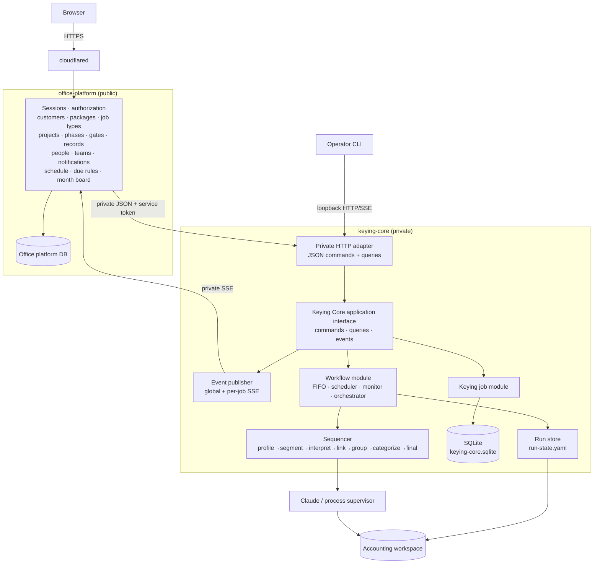
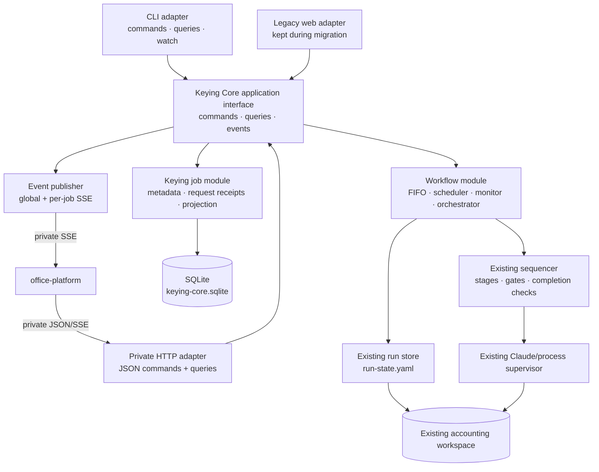
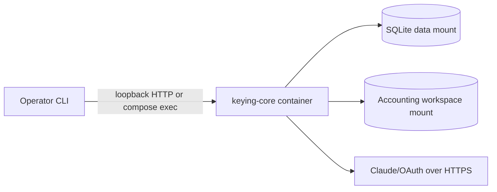
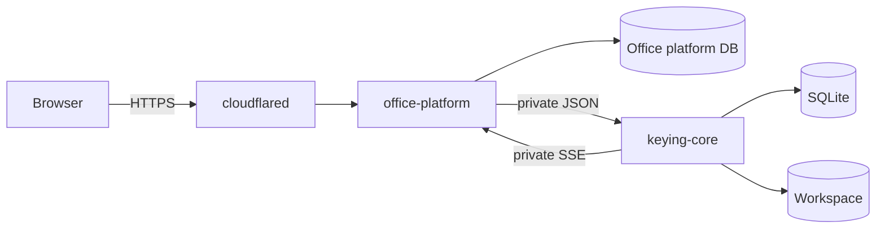
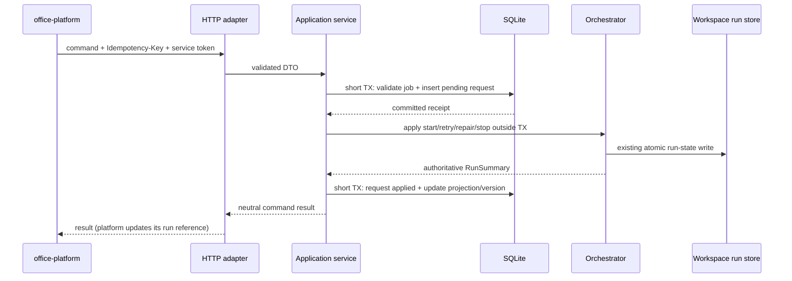

# Keying Core modular-monolith implementation plan

Status: proposed — authoritative plan
Date: 2026-08-06
Revised: 2026-08-07 — **revision 2**, which folds in the office platform (§0.1–0.3);
then **revision 3**, which folds in the captain's four answers (§0.4)
Planning branch: `plan/keying-core-modular-monolith`
Baseline inspected: `origin/main@488220e` (revision 1); `origin/main@f3b36f8` (revision 2);
`origin/main@40d7394` (revision 3)
Companion documents:

- `docs/plans/2026-08-06-api-service-separation-plan.md` — superseded as a *keying-runtime*
  split; **partially revived** by revision 2 as the office-platform boundary.
- `docs/plans/2026-08-06-single-host-task-manager-workflow-architecture.md` — superseded;
  two of its elements (a web/BFF service and the private HTTP + SSE link) return in
  revision 2, its five-container/PostgreSQL shape does not.

## 0. Revision history — what changed, and the tensions it resolves

Sections 0.1–0.3 record revision 2 and are unchanged. Section 0.4 records revision 3.

### 0.1 What the captain asked for (revision 2)

> "คือ pull เอา mock เข้าไปรวมครับ และจริงๆผมมองว่าเราควรแยก module/service จากกันด้วย
> แต่ตัวระบบสำนักงาน มันจะมีไป call api ของ keying core แน่นอน ทั้ง https / sse"

Three instructions, taken as design constraints:

1. Fold the mock's domain into this architecture. The plan must describe the whole system,
   not only the keying engine.
2. Separate the office platform from Keying Core as distinct services with a real network
   boundary, not as modules in one process.
3. The direction is fixed: the office platform is the **client**, Keying Core is the
   **server**, over HTTP and SSE.

### 0.2 The tension with revision 1, stated rather than papered over

Revision 1's central claim was *one modular monolith*, and on that basis it declared the
API-separation plan superseded. Revision 2 is being asked for separation. These are only
contradictory if "modular monolith" was a claim about the whole product. It was not — it
was a claim about the **keying runtime**, and the argument for it was specific: the
scheduler, queue, monitor, orchestrator, and sequencer share in-memory state (active slots,
process handles, cancellation) and a single writer to the accounting workspace. Splitting
*those* across a network buys nothing and costs correctness.

The coherent reading, and the one this revision designs to:

> **Keying Core stays a modular monolith internally.** It keeps absorbing the workflow
> scheduler, queue, and monitor; it does not fragment into microservices; it remains the
> only writer of `run-state.yaml` and the accounting workspace. **The office platform
> becomes a second service outside that boundary**, with its own store, its own session and
> authorization model, and no access to the workspace at all.

That reading survived contact with the mock, and the mock in fact argues *for* it. The mock
already treats the keying pipeline as a foreign system: a run is an "automation workflow"
attached to a Phase, drawn as a dashed second track, whose result is **evidence** a person
reads and never a signature the system may give
(`platform-mock-p0/app/src/data/workflows.ts:13-31`;
`src/pages/projectDetail/WorkflowTrack.tsx:1-2`). The office platform's own domain —
customers, packages, job types, phases, gates, people, teams, notifications, schedule — has
no overlap with the sequencer's. Two services with one narrow contract is the shape the
mock was already drawn in.

One place the reading was genuinely strained, and it was recorded rather than smoothed over:
the mock keeps a **run history** per (project, phase, workflow) in which each finished run
is an immutable record, while Keying Core keeps **one** run-state per client/month that a
retry mutates in place. **Revision 3 settled this in Core's favour — there is no run
history** (§0.4, §2.4, §21).

### 0.3 How to read this document

Every factual claim about the mock is tagged, and the tag is load-bearing:

| Tag | Meaning |
|---|---|
| **[M]** | Grounded in a real file under `platform-mock-p0/app/`, cited `file:line`. It is behaviour the mock actually has. |
| **[M-sketch]** | The mock renders it, but there is no behaviour behind it — simulated, hardcoded, or decoration. Do **not** treat it as a settled requirement. |
| **[P]** | A design proposal in this document. The mock does not show it. |

All mock paths are relative to `platform-mock-p0/app/`. Section numbers 1–22 are unchanged
from revision 1 in both number and meaning; new material is added as sub-sections, plus one
new §23. Readers who only know the mock should start at §2.2, §6.1, and §9.5.

Revision 3 adds a fourth tag, used only where a settled question left a residue:

| Tag | Meaning |
|---|---|
| **[A]** | A **working assumption**, deliberately labelled as one. It is what the design proceeds on so that work is not blocked, and it is *not* a decision. Every **[A]** has a matching `needs-decision` in §23. |

### 0.4 Revision 3 — the four answers the captain gave

The captain answered four of §23's `needs-decision` items. Each answer is folded into the
design section that owns it, and the settled item has moved from §23 to §21. What changed:

1. **No run history** (was §23.2, now §21). "มันเป็น mock จะทับของเดิมก็ได้" — the mock is a
   mock, and overwriting what is there is fine. Core keeps **one** `run-state.yaml` per
   client/month and **one** `run_projections` row per job; a retry mutates in place, exactly
   as the current runtime already does. This selects the document's option 3 and **reverses**
   a mock design the captain reviewed and approved in round 13. It has a stated cost, written
   out in §2.4: the office platform can show the *current* result of a keying run and no
   previous attempt. In exchange, §12.2's invariant that artifact paths do not move survives
   intact, and Core's schema does not grow a per-run dimension. Changed: §0.2, §2.3, §2.4,
   §8.1, §8.2, §9.5, §12.2, §15 (phase 8), §16, §20, §21, §22.
2. **People get a stable identity, bound, with history** (was §23.6, now §21 — except the
   provider). "ต้องผูกไว้ ลาออกแล้วก็ต้องรู้ ต้องเป็นประวัติ" — a person must be bound to a
   stable identity; after they leave it must still be knowable who did the work; it must be a
   history. A person therefore gets a `personId` that is not a display name and never changes;
   every historical `doer` / `reviewer` / gate signoff references that id; a person record is
   never deleted and leaving is a state on it; the display name becomes a mutable attribute.
   This is **stronger** than the mock, which keys `USERS` by name and freezes the name into
   historical records. Changed: §2.3, §8.5, §9.4, §14.2, §15 (phase 7 and 8), §16, §19, §20,
   §21, §22. The *provider* question the captain did not answer survives, narrowed, as §23.6.
3. **Month identity is an enforced format** (was §23.1, now §21 — except the non-monthly
   residue). "เดี๋ยวทำจริง folder เราก็จะบังคับ ปี-เดือน (69-08) แล้ว folder ไม่ตรงไม่อ่าน (หรือ
   เตือนถ้าเจอชื่อไม่ตรง)" — month folders are forced to `YY-MM` on the short Buddhist year,
   a folder that does not match is not read, and a non-matching name that is found is
   reported. `monthId` stops being a free-form directory name and becomes a validated format,
   which makes the platform's `"2569-08"` → Core's `"69-08"` mapping mechanical and removes the
   bridging problem the mock declined to solve. Changed: §3.1, §9.1, §9.2, §11, §12.1,
   §15 (phase 6 and 8), §16, §18, §19, §20, §21, §22. What `monthId` means for a งวด that is
   not a month survives, narrowed, as §23.1.
4. **The office platform's store is SQLite** (was §23.7, now §21). "SQLite แน่นอน" — two
   services, each with its own SQLite file, on one host, under Core's existing runtime rules
   (§8.3). PostgreSQL is out of the body of the document; §21 keeps the one line of history.
   Changed: §1, §8.5, §13.3, §14.2, §15 (phase 7), §19, §20, §21, §22.

What §23 still holds after this revision: the identity provider (23.6), the non-monthly งวด
(23.1), and 23.3, 23.4, 23.5, 23.8 — none of which these four answers touch.

## 1. Outcome

Build **two** deployable applications.

**Keying Core** — one process combining keying-job management with the existing workflow
scheduler, queue, monitor, orchestrator, review operations, and workspace integration. It is
a modular monolith, not a set of networked Task Manager and Workflow services. CLI, private
HTTP, SSE, the current website during migration, and the office platform are adapters and
clients around the same application commands, queries, and events.

**Office platform** — the office-wide work system the mock describes: customers and the
packages they bought, job types as editable Phase→Gate templates, projects (one customer ×
one job type × one งวด), the Gate checklist and its review ladder, people and teams,
notifications, the recurring schedule, the month calendar, and the office overview. It is
the only public ingress, the only place a human signs in, and the only owner of who-signed-
what. It calls Keying Core over private HTTP and consumes its SSE stream. It never mounts
the accounting workspace and never runs a second scheduler.

Initial production shape:

- one Linux host, one Compose project;
- one `keying-core` process/container — embedded SQLite for job metadata and durable command
  receipts, existing workspace files for authoritative workflow/run state and artifacts,
  concurrency defaults to one, no public hostname;
- one `office-platform` process/container — **its own SQLite file** on its own local data
  mount, its own sessions, the only service behind the public tunnel **[r3]**;
- no PostgreSQL, Redis, RabbitMQ, or separate worker container — neither service uses a
  database server **[r3]**;
- no public Keying Core API, and no browser call to Keying Core.

For Keying Core this remains an extraction and interface project, not a pipeline rewrite.
The office platform is new build, and this document defines its boundary and its contract —
not its UI, which the mock already specifies.

## 2. Terminology and ownership

### 2.1 Service-level terminology

| Term | Meaning | Owner |
|---|---|---|
| Keying Core | The single deployable keying backend | This repository |
| Office platform | The office-wide work system the mock describes | New service; mock at `platform-mock-p0/app/` |
| Keying job | A manageable unit bound to one workspace-relative client/month | SQLite metadata + Keying Core application layer |
| Workflow run | The actual sequencer state and stage execution for a client/month | Existing orchestrator and workspace `run-state.yaml` |
| Workflow queue | The real FIFO/concurrency scheduler that executes runs | Existing orchestrator inside Keying Core |
| Workflow request | A durable receipt for start/retry/stop requested through an interface | SQLite inside Keying Core |
| Status projection | A query-friendly copy of the latest authoritative run summary | SQLite; always reconcilable from orchestrator/workspace |
| Run reference | The office platform's local copy of a run's identity, state, and headline counts | Office platform store; **derived**, never authoritative |
| Interface | CLI, private HTTP/JSON, SSE, current legacy web, or the office platform | Adapters and clients; never owners of workflow truth |

The term "worker" is intentionally avoided in the target architecture. There is no separate
worker service, and — reversing the companion five-service document — no integration worker
between the platform and Core either: the platform calls Core directly. An in-process
request pump may apply pending workflow requests, but the real scheduler and monitor remain
inside the workflow module.

### 2.2 Office platform vocabulary, from the mock

These are the mock's own words. Where the mock carries Thai labels, they are quoted verbatim
because they are the office's language, not a translation choice.

| Term | Meaning | Where it is defined |
|---|---|---|
| **Job type** (`ประเภทงาน`) | The template: `{ key, name, phases[] }`. Admin-editable, not an enum. **[M]** | `src/types.ts:33-37`; editor `src/pages/JobTypesPage.tsx:42-61` |
| **Phase** (`เฟส`) | A stage of work inside a job type: `{ name, gates[], workflows? }`. **[M]** | `src/types.ts:27-31` |
| **Gate** (`เกท`) | One checklist requirement: `{ code, name, required, freq?, note?, actor?, due?, review? }`. Codes are dotted, `"1.1"`…`"5.8"`. **[M]** | `src/types.ts:10-20`; seed `src/data/jobTypes.ts:65-351` |
| **There is no 4th level** | Job type → Phase → Gate, and nothing else. **[M]** | `src/data/jobTypes.ts:12-19` |
| **Project** (`โปรเจกต์`) | One customer × one job type × one งวด. **[M]** | `src/types.ts:148-168` |
| **งวด** (period) | The accounting period a project covers; `monthKey` is `"YYYY-MM"` in **Buddhist era**, e.g. `"2569-08"`. **[M]** | `src/domain/dates.ts:15-18` |
| **Gate record** | The per-project instance of a Gate: `{ status, doer, reviewer, doneAt, note, noDocs }` — the office's own five sheet columns plus `noDocs`. **[M]** | `src/types.ts:139-146` |
| **สถานะ** | Exactly three values: `ยังไม่เริ่ม` / `กำลังทำ` / `เสร็จ`. There is no fourth. **[M]** | `src/domain/work.ts:17-18` |
| **Closed** vs **awaiting review** | `closed` = `เสร็จ` **and** signed; `awaiting review` = `เสร็จ` and unsigned. Derived, never stored as a flag. **[M]** | `src/domain/work.ts:149-150` |
| **Review rung** | `"deputy" \| "lead" \| "coo"` — how far up the ladder a Gate must be signed. **[M]** | `src/types.ts:8`; ladder `src/data/office.ts:46` |
| **Position** | `intern \| staff \| deputy \| lead \| coo`, carrying `canReview` / `canSeeOffice` / `canEditPermissions`. **[M]** | `src/data/office.ts:35-41` |
| **Package** (`แพ็กเกจ`) | What a customer bought: `{ jobType, recurrence, startedAt, endedAt, paused, fee, skips[] }`. The source of what recurs. **[M]** | `src/types.ts:89-99` |
| **Workflow** (automation) | A configurable thing an admin *attaches to a Phase*. Not a Phase, not a Gate, not a Gate status. Exactly one exists: `ksk-keying`. **[M]** | `src/data/workflows.ts:13-59` |
| **Evidence** | The Gate codes a workflow's result speaks for — `monthly` Phase 2 → `["2.1","2.2","2.3","2.4"]`. **[M]** | `src/data/gateRules.ts:88-90` |
| **No auto-pass** | Automation may report its own result; it may never sign a checklist item that carries a human reviewer. **[M]** | `src/data/workflows.ts:14-19`; three UI restatements incl. `src/pages/projectDetail/WorkGate.tsx:63` |
| **Actor** (`ระบบคีย์เอกสาร KSK (อัตโนมัติ)`) | The automation's own name, used wherever a person's name would sit; never selectable as ผู้ทำ/ผู้สอบทาน. **[M]** | `src/data/workflows.ts:39` |
| **`noDocs`** | "The customer has nothing to give", recorded on a customer-facing Gate. Deliberately not a fourth สถานะ. **[M]** | `src/domain/gateActions.ts:47-80` |

### 2.3 Domain model — who owns what

Every entity the mock implies, the service that owns it, and where the authoritative copy
lives. "Office platform" here means a store that does not exist yet; the mock holds all of
this in mutable module-level objects with no persistence at all
(`src/state/stores.ts:1-5`) **[M-sketch]** — so *every* row below is a proposal about
persistence even where the entity itself is **[M]**.

| Entity | Fields (mock) | Owner | Authoritative store |
|---|---|---|---|
| `Customer` **[M]** `src/types.ts:110-124` | `code, legalName, displayName, taxId, businessNature, status, lineGroupId, note, onboardedAt, vatRegistered, fiscalYearEnd, packages[], contacts[]` | Office platform | Platform DB |
| `CustomerContact` **[M]** `:101-108` | `name, role, phone, email, lineId, isPrimary` | Office platform | Platform DB |
| `CustomerPackage` **[M]** `:89-99` | `id, jobType, recurrence, startedAt, endedAt, paused, fee, note, skips[]` | Office platform | Platform DB |
| `PackageSkip` **[M]** `:82-87` | `period, reason, by, at` | Office platform | Platform DB |
| `JobType` / `Phase` / `Gate` **[M]** `:33-37, :27-31, :10-20` | template tree; `Gate.due` and `Gate.review` merged from `GATE_RULES` at load (`src/data/gateRules.ts:106-111`) | Office platform | Platform DB |
| `GateRule` **[M]** `:39-42` | `due?, review?` | Office platform | Platform DB |
| `PhaseWorkflowAttachment` **[M]** `:22-25` | `key, evidence[]` — the only structural link to Keying Core | Office platform | Platform DB |
| `Project` **[M]** `:148-168` | `id, customerId, assignee, jobType, periodLabel, monthKey, phaseIndex, status, openedOn, openedBy, openedHow, work[][]` | Office platform | Platform DB |
| `GateRecord` **[M]** `:139-146` | `status, doer, reviewer, doneAt, note, noDocs` — `doer`/`reviewer` are **names** in the mock, **`personId` references** in the target (§8.5) **[r3]** | Office platform | Platform DB — **never writable by Keying Core** (§9.4) |
| `Team` **[M]** `:54-61` | `key, name, lead, deputy, staff[], interns[]` | Office platform | Platform DB |
| `User` / person **[M]** `:63-67` | `team, position, initials`, keyed by **name** in the mock | Office platform | Platform DB — **re-keyed on a stable `personId`, never deleted, name is a mutable attribute** (§8.5) **[r3]** |
| `Position` **[M]** `src/data/office.ts:35-41` | `label, canReview, canSeeOffice, canEditPermissions` | Office platform | Platform config |
| `Notification` **[M]** `:263-272` | `id, to, kind, title, context, target, at, read` | Office platform | Platform DB |
| `ScheduleSnapshot` / `DueRow` **[M]** `:293-303` | derived from packages every render (`src/domain/schedule.ts:130-158`) | Office platform | **Derived — never stored** |
| `PhaseTrail` **[M-sketch]** `:306-313` | per-phase start/end/days; in the mock these are **seeded from a hash**, not measured (`src/domain/trail.ts:20-22,42-48`) | Office platform | Requires a phase-transition event log that does not exist (§23.5) |
| **Keying job** **[P]** | `jobId, workspaceRelPath, title, archived, timestamps` | **Keying Core** | Core SQLite |
| `WorkflowRun` **[M]** `:246-260` | `no, state, step, customerId, monthKey, periodLabel, failStep, failWhy, startedAt, finishedAt, startedBy, data` | **Split** — see §2.4. The platform holds a reference to the **current** run, not a list **[r3]** | Core (execution) + platform (reference) |
| `WorkflowRunData` **[M]** `:237-244` | `buckets[], excluded[], groupCount, pageCount, totalUnits, attention` | **Keying Core** | Workspace artifacts (`_doc_groups/**`, review data) |
| `RunBucket` / `RunGroup` / `RunLine` / `RunFacts` **[M]** `:199-226, :182-197` | the interpreted accounting evidence | **Keying Core** | Workspace artifacts |
| `RunExclusion` **[M]** `:228-235` | `unit, file, page, reason, duplicate_of, decision` | **Keying Core** | Workspace — the decision is an Exclusion Declaration, a Ledger-Gate artifact |
| Chart of accounts | **absent from the mock** — `WF_COA_*` are hardcoded demo tables (`src/data/runTables.ts:37-64`) **[M-sketch]** | **Keying Core** | `<client>/coa.csv`, `coa_usage.json` |
| Client profile / conventions | **absent from the mock** — `dropboxRoot` was explicitly considered and left out (`src/data/customers.ts:5-8`) **[M]** | **Keying Core** | `<client>/CLIENT.md` |

Two ownership rules follow, and both are absolute:

1. **Keying Core never learns about Phases, Gates, signatures, people, or teams.** It has no
   model for them. This is what makes "no auto-pass" structural rather than a policy
   somebody has to remember: Core *cannot* sign a Gate because it has no gate to sign.
2. **The office platform never touches the accounting workspace.** Every document, artifact,
   line item, and export byte is reached through Core's API. The platform stores no copy of
   a client's accounting data beyond the headline counts in a run reference.

### 2.4 The entity that straddles the boundary: a keying run

A run is visible on both sides, and the split has to be stated precisely.

In the mock, one `WorkflowRun` object carries three unrelated things at once **[M]**
(`src/types.ts:246-260`, `src/domain/runs.ts:55-77`):

- **office scope** — `customerId`, `monthKey`, `periodLabel`, `startedBy`;
- **execution state** — `no`, `state`, `step`, `failStep`, `failWhy`, `startedAt`,
  `finishedAt`, `timer`;
- **result** — `data: WorkflowRunData`, the whole interpreted document set.

In the target, that object splits at the boundary **[P]**:

| Field | Lives in | Why |
|---|---|---|
| `customerId`, `monthKey`, `periodLabel`, project/phase/workflow key | Office platform | Office scope. Core knows only `workspaceRelPath`. |
| `startedBy` | Office platform (authoritative), passed to Core as advisory attribution | Core does not authenticate end users (§9.4) |
| `state`, `step`, `failWhy`, `startedAt`, `finishedAt` | **Keying Core** (authoritative) | These are sequencer/orchestrator truth |
| `data` (buckets, groups, lines, facts, exclusions) | **Keying Core** (authoritative) | These are workspace artifacts |
| headline counts (`totalUnits`, `groupCount`, `attention`, `excluded.length`) | Office platform, as a **cached projection** | So the Phase card and the project list render without an API call per project |

The office platform therefore stores **one run reference per (project, phase, workflow)**:
`{ runRef, jobId, projectId, phaseIndex, workflowKey, no, state, stageIndex, startedBy,
startedAt, finishedAt, counts }`. It is a **reference to the current run, not a list of
runs** — a re-run overwrites it in place **[r3]**. It is derived. On any disagreement, Core
wins; the platform refreshes it from Core rather than reconciling.

`no` deserves a note. In the mock it is a global monotonic counter (`src/state/stores.ts:58`,
starting at 400) used as a display ordinal and as part of the review URL
(`/projects/:id/runs/:pi/:key/:no`, `src/navigation.ts:23-24`) **[M]**. Under the split,
Core assigns the authoritative `runRef`; the platform keeps `no` as a per-(project, phase,
workflow) **attempt counter** that increments on each re-run **[P]**. It is a display ordinal
and a cache-busting token, not a key into a history: the mock's review URL shape survives, but
only the current `no` resolves. Requesting an older `no` is a `404`, and the platform should
redirect to the current run rather than render an empty page **[r3]**.

#### The run-history reversal, and what it costs — **decided in r3**

The mock's run history is append-only and immutable: "a re-run appends; nothing is
overwritten, because a run somebody has already read is a record", and each run carries *its
own* result set so re-running visibly produces new numbers
(`platform-mock-p0/README.md` §Round 13; `src/domain/runs.ts:1-7`) **[M]**. Keying Core keeps
**one** `run-state.yaml` per client/month and **one** `run_projections` row per job, which a
retry mutates in place (§8.1, §8.2). Revisions 1 and 2 recorded these two models as
incompatible and left the choice open.

**The captain chose Core's model: there is no run history. Overwriting is correct.**
"มันเป็น mock จะทับของเดิมก็ได้" — the mock is a mock, and overwriting what is there is fine.
The mock's append-only run history is a **mock affordance, not a requirement**.

This is a **deliberate reversal of a design the captain reviewed and approved in round 13**.
It is recorded as a reversal rather than presented as if the question had never been settled
the other way, because the round-13 writeup remains in `platform-mock-p0/README.md` and a
future reader will otherwise find two answers and no note saying which won.

**What it costs, stated plainly and not softened:**

- The office platform can show the **current** result of a keying run, and no previous
  attempt. "What did the run say before we re-ran it?" is **not answerable** — not from the
  platform, not from Core, not from the workspace. The previous answer is gone the moment a
  re-run overwrites it.
- A person who read a run, re-ran it, and wants to know what changed cannot diff the two.
  There is nothing to diff against.
- If a re-run is *worse* than the run it replaced, the better result is unrecoverable except
  by keying it again and hoping.
- `ประวัติการรัน` — the mock's run-history list — has no data behind it and does not ship
  (§9.5).

**What it buys, and why the trade is coherent:** §12.2's invariant that artifact paths do not
move is **preserved rather than broken**. Option 1 would have grown a per-run artifact
directory under `ข้อมูลระบบ/`, moving every path the existing pipeline, review pages, and
export already depend on. Option 2 would have put a copy of the client's accounting data in
the public service, which §2.3 forbids outright. Core's schema stays one-row-per-job (§8.2)
and the runtime keeps the exact overwrite behaviour it already has, so this decision costs no
implementation at all — it is the absence of one.

If run history is ever wanted, the cheap re-entry is a bounded, opt-in **archive on re-run**
(copy the previous `ตรวจทาน/` and `_doc_groups/` under a timestamped sibling before
overwriting), not a per-run schema. Recorded so the door is visible, not because it is
planned.

## 3. Verified current baseline

### 3.1 The keying runtime

The current process already contains most of the required Core behavior:

1. `console/sequencer/logic.ts` is the pure workflow state machine with seven stages,
   injected process/gate seams, bounded retry behavior, and terminal states. The stages are
   `profile → segment → interpret → link → group → categorize → final`
   (`console/sequencer/logic.ts:53-60`).
2. `console/app/orchestrator.ts` owns the real in-memory FIFO, active slots,
   `KSK_APP_CONCURRENCY`, start/retry/repair/stop behavior, process cancellation,
   persistence calls, startup recovery, and subscriptions.
3. `console/app/run-store.ts` persists each client/month to
   `ข้อมูลระบบ/_pages/run-state.yaml` using temp-file + rename. On boot, the
   orchestrator scans these files and rebuilds resumable queue state.
4. `console/app/server.ts` currently combines neutral run APIs, SSE, review APIs,
   filesystem routes, and server-rendered HTML in one `Bun.serve()` handler.
5. `console/app/server.ts` already subscribes to the orchestrator and exposes global and
   per-run SSE, but the global dashboard payload contains pre-rendered HTML and therefore
   is not yet a neutral integration contract.
6. `console/docker-compose.yml` currently runs `ksk-app` and `cloudflared` with host
   networking and mounts the workspace plus Claude credentials into the application.
7. Workspace identity is a **two-level** walk: `<workspace>/<clientId>/<monthId>`, with
   `relPath = clientId/monthId` (`console/app/workspace.ts:1-3,102-103`). No format is
   imposed on `monthId` today — it is whatever the directory is called. **Revision 3 imposes
   one** (`YY-MM`, §9.2); this row records the baseline being changed, not the target.

No workflow file under `console/` changed between the earlier inspected `main@1a51d4d`, the
revision-1 baseline `488220e`, and the revision-2 baseline `f3b36f8`; later commits only
changed prototype material outside the runtime.

### 3.2 The office platform mock

Added since revision 1 was written, and the reason for this revision. `platform-mock-p0/app/`
is a Vite + React + TypeScript app run with Bun, ~108 source files, replacing the deleted
single-file `index.html` (`platform-mock-p0/app/README.md`).

**Eleven screens exist**, each a real route **[M]** (`src/App.tsx:36-50`,
`src/navigation.ts:12-39`):

| Route | Title | What it is |
|---|---|---|
| `/login` | เข้าสู่ระบบ | User picker (§4 below) |
| `/` | งานของฉัน | Per-person work, two lanes: `รอคุณ — ทำได้เลย` / `รอคนอื่น` |
| `/overview` | ภาพรวมสำนักงาน | Office-wide sections, pace, workload |
| `/customers` | ลูกค้า | Customer list (113 seeded) |
| `/customers/:id` | รายละเอียดลูกค้า | Profile, packages, 12-period timeline |
| `/month-board` | ปฏิทินงานประจำเดือน | Deadline spine + `รอบที่ถึงกำหนดเปิด` |
| `/notifications` | การแจ้งเตือน | Per-person notification list |
| `/people` | พนักงานและทีม | Teams, positions, placement, load |
| `/job-types` | ประเภทงาน | Phase→Gate template editor |
| `/projects/:id` | รายละเอียดโปรเจกต์ | The working screen: Phase panels, Gate checklist, workflow track |
| `/projects/:id/runs/:pi/:key/:no` | ตรวจทานผลการรัน | The keying run review |

Facts that constrain the architecture:

- **Nothing persists.** All state is mutable module-level objects; refresh resets to seed
  (`src/state/stores.ts:1-5`) **[M]**. There is no backend, no API call, no `localStorage`.
- **"Today" is hardcoded** — `TODAY = "5/8/2569"`, `TODAY_DATE = new Date(2026, 7, 5)`,
  `NOW_MONTH_KEY = "2569-08"` (`src/domain/dates.ts:3-7`, `src/domain/trail.ts:137`)
  **[M-sketch]**. Every "days until / days late" figure is real arithmetic against a literal.
- **Scale is real**: 113 customers (6 hand-written + 107 generated), ~210 projects, 5 job
  types carrying 135 Gate templates (37/37/20/22/19) (`src/data/officeScale.ts:12-13`,
  `src/data/jobTypes.ts:65-351`) **[M]**.
- **The keying run is entirely simulated**: `setTimeout` chains walk `queued → running →
  done/failed` in 700–850 ms steps, and the result set is deterministic pseudo-random from
  `hash(projectId) + runNo` (`src/domain/runs.ts:79-107`, `src/domain/runData.ts:19-24,112-118`)
  **[M-sketch]**. No folder is read; no PEAK file is written.
- **Gate work is real** within the session: tick, sign, `noDocs`, field edits and phase
  advance all mutate the store and drive every derived screen
  (`src/domain/gateActions.ts:19-137`) **[M]**.

## 4. Goals

Unchanged from revision 1 except where the second service changes them:

- Give Keying Core one stable application interface independent of CLI or web.
- Keep the workflow queue, monitor, scheduler, and authoritative statuses in Core.
- Support commands and queries through both CLI and private HTTP.
- Support global and per-job status updates through SSE.
- **Let the office platform own the office's work model** — customers, packages, job types,
  projects, gates, people, teams, notifications, schedule — and aggregate Keying status into
  it **without mounting the accounting workspace or duplicating workflow state**. (Revision 1
  said "a future office website"; that service is now specified, not hypothetical.)
- **Give the office platform everything the mock's eleven screens need** from Core through a
  contract narrow enough to enumerate (§9.5).
- Add lightweight keying-job metadata without replacing existing run-state/artifact files.
- Preserve all current inputs, outputs, status transitions, gates, review behavior, exports,
  process supervision, and mount requirements.
- Allow one-container operation before the office platform exists.
- **Make "no auto-pass" structural**: the boundary must make it impossible for Keying Core to
  record a Gate signature, not merely forbidden.

## 5. Non-goals

- Building the office platform's UI. The mock specifies it; this document specifies its
  boundary, its store's ownership, and its contract with Core. (Revised: revision 1 listed
  the whole website as a non-goal.)
- Moving accounting artifacts into SQLite, or into the office platform's store.
- Replacing the sequencer, completion checks, Claude stage commands, or retry policy.
- Running multiple Keying Core replicas.
- Exposing Keying Core directly to the public Internet, or to a browser.
- Introducing a distributed job broker or database server.
- Generalizing Keying Core into the owner of non-keying office tasks. It stays keying-only;
  the office platform owns everything else.
- Splitting the office platform further. Two services, not five.
- Creating a generic arbitrary-filesystem API.

## 6. Target architecture

### 6.1 System decomposition — two services, one boundary



**Why the boundary sits exactly there.** Four independent reasons, each checkable:

1. **Different truth, different store.** Everything the office platform owns is
   record-keeping whose truth is "what a person decided" — it exists nowhere else and cannot
   be recomputed. Everything Keying Core owns is derived from documents on disk and is
   reproducible by re-running. The two share no invariant that needs protecting in one
   transaction.
2. **Different blast radius.** Core mounts the accounting workspace, the Claude credentials,
   and spawns cost-producing subprocesses. The platform is the public-facing service. Keeping
   the public service out of those mounts is the single largest security win available, and
   it is exactly what the companion five-service document argued (`§Networks`).
3. **Different lifecycle.** The mock's own design rounds change weekly; the sequencer's stage
   contract has not changed across three inspected baselines (§3.1). Fusing them would force
   one deploy cadence on both.
4. **The mock already drew it this way.** The keying pipeline appears as a *foreign* actor
   with its own name, on a dashed track, whose result never signs anything
   (`src/data/workflows.ts:13-31`) **[M]**. Making that a process boundary changes the
   drawing into a guarantee.

**Why the boundary does not sit anywhere else.** Splitting Core further (job service /
workflow service) is rejected for revision 1's original reason: active-slot accounting,
process handles, and cancellation are in-memory state shared by the queue and the sequencer,
and the workspace has exactly one writer. Splitting the platform further is rejected because
every one of its screens joins across three or more of its entities — `งานของฉัน` alone joins
projects, gate records, teams, positions, and due rules (`src/domain/myWork.ts:31-60`) **[M]**.

### 6.2 Inside Keying Core: one application, several adapters



There is no HTTP call between the job module and workflow module. They meet through the
in-process application interface.

### 6.3 Inside the office platform

The mock is already layered this way and the layering should survive the port **[M]**
(`platform-mock-p0/app/README.md` → Layout):

- `domain/` — pure logic with no I/O: `work.ts` (gate predicates), `gateActions.ts`
  (transitions), `schedule.ts` (recurrence), `due.ts` + `jobTypes.ts` (deadline rules),
  `people.ts` + `structure.ts` (review ladder), `notifications.ts`, `pace.ts`, `trail.ts`.
- `data/` — the templates: job types, gate rules, phase-workflow attachments.
- one new layer the mock does not have **[P]**: a **keying gateway** — the only module
  allowed to call Keying Core, holding the HTTP client, the SSE subscription, the run
  reference cache, and the mapping from `(customerId, monthKey)` to `workspaceRelPath`.

Nothing outside the keying gateway may know Keying Core exists. That is what keeps the mock's
"one automation among possibly many" model (`phase.workflows` is a list, `WORKFLOWS` is a
catalogue an admin picks from — `src/data/workflows.ts:28-31`) **[M]** from collapsing into a
hardcoded integration.

### 6.4 Deployment stages

Before the office platform exists — unchanged from revision 1:



With the office platform:



Only the office platform is public. The browser does not call Keying Core directly. The
platform proxies Keying commands, queries, and SSE to its authenticated browser UI.

## 7. Module boundaries

### 7.1 Keying Core application interface

All adapters call the same use cases. No adapter may import SQLite repositories,
orchestrator internals, or filesystem writers directly.

Commands:

- register/update/archive a keying job;
- start a job's workflow;
- retry a blocked/environment-error workflow;
- repair or stop a run;
- resolve existing human/review actions — including **exclusion decisions** and **reviewer
  edits to interpreted groups**, which the office platform's review screen performs (§9.5);
- rebuild review data where the current API permits it.

Queries:

- list/get keying jobs;
- list/get workflow runs;
- inspect the real queue and active slots;
- obtain current status/progress/gate information;
- obtain allowlisted review/download references;
- **obtain review read models** — buckets, groups, lines, facts, exclusions — as neutral JSON
  rather than the rendered review page **[P]**.

Events:

- job created/updated/archived;
- run queued/started/status-changed/progress-changed;
- human action requested/resolved;
- run completed/failed/stopped;
- queue changed.

### 7.2 Keying job module

The job module owns metadata needed by an interface or the office platform:

- stable opaque `jobId`;
- unique `workspaceRelPath` (`<client>/<month>`);
- display title and optional priority/assignee/external reference;
- archived flag and timestamps;
- durable workflow request receipts;
- current status projection.

It does not own stage transitions, retry eligibility, queue order, completion, accounting
artifacts, or anything at all about Phases, Gates, people, or signatures.

`externalRef` is the platform's hook: the office platform's `(projectId, phaseIndex,
workflowKey)` triple goes here, so Core can echo it back on every event without understanding
it **[P]**.

### 7.3 Workflow module

The workflow module retains:

- the real FIFO queue and `KSK_APP_CONCURRENCY` behavior;
- active-slot accounting;
- `enqueueRun`, `retryRun`, `repairRun`, and `stopRun` semantics;
- startup scan and safe requeue rules;
- sequencer transitions, gates, completion checks, and bounded retries;
- child process-group supervision and shutdown cleanup;
- run-state persistence and orchestrator subscriptions.

The workflow module remains authoritative even if SQLite projections, the office platform's
run references, or interface connections are stale.

### 7.4 Keying Core adapters

The CLI and HTTP adapter perform only parsing, authentication, validation-to-DTO mapping,
status-code/exit-code mapping, and presentation. The SSE adapter converts internal events to
a versioned envelope. The current server-rendered website remains a legacy adapter during
migration and may be retired independently later.

### 7.5 Office platform modules

| Module | Owns | Notes |
|---|---|---|
| Identity & session | Sign-in, session lifetime, position→capability resolution | Replaces the mock's user picker (§9.4) |
| Directory | People, teams, placement, the review ladder | `reviewerFor()` must stay **derived**, not stored (`src/domain/people.ts:66-79`) **[M]** |
| Customers | Customers, contacts, packages, skips | |
| Templates | Job types, phases, gates, gate rules, workflow attachments | Editing is real in the mock (`src/pages/JobTypesPage.tsx:42-61`) **[M]** |
| Work | Projects, gate records, phase advance, `noDocs` | The single write path for anything a person signs |
| Scheduling | Recurrence, `openPeriod()`, due-rule evaluation, month board | `openPeriod()` is the **only** project-creation path (`src/domain/schedule.ts:201-244`) **[M]** — keep it that way |
| Notifications | The five kinds, addressing, read state | §10.3 |
| Analytics | Pace, workload, phase trail | Needs an event log the mock does not have (§23.5) |
| **Keying gateway** | The HTTP client, the SSE subscription, run references, path mapping | The only module that knows Core exists **[P]** |

## 8. Persistence and consistency

### 8.1 Sources of truth

| Fact | Authoritative store | Derived/cache |
|---|---|---|
| Customers, packages, job types, projects, gate records, people, teams, notifications | Office platform DB | Platform-side derivations (schedule, due, pace, workload) — all recomputed, never stored |
| Job metadata, external reference, requested priority/assignee | Core SQLite | Interface memory |
| Accepted command receipt and idempotency key | Core SQLite `workflow_requests` | none |
| Queue membership and active slots | In-process orchestrator | Exposed run summary |
| Stage/status/retry/gate truth | In-process orchestrator plus existing sequencer state persisted at rest points in `run-state.yaml` | Core SQLite projection; **office platform run reference** |
| Accounting/review/export artifacts, interpreted groups, exclusions, COA | Existing workspace files | Allowlisted references only; office platform holds **counts only** |
| Who signed which Gate | **Office platform DB, exclusively** — as a `personId` reference, never a name string (§8.5) **[r3]** | nothing — Core never sees it |

SQLite does not replace `run-state.yaml`. The split is deliberate: SQLite describes the job
and accepted requests; the existing workspace describes what the workflow actually did; the
office platform describes what the office decided.

**Each of those describes exactly one attempt [r3].** There is one `run-state.yaml` per
client/month, one `run_projections` row per job, and one run reference per (project, phase,
workflow). A retry overwrites all three in place. No previous attempt is retained anywhere —
see §2.4 for the decision and its cost.

### 8.2 Initial SQLite schema (Keying Core)

The first migration should create only the minimum tables:

| Table | Purpose | Important constraints |
|---|---|---|
| `schema_migrations` | Applied migration versions | one row per version |
| `keying_jobs` | Job identity and interface metadata | unique `workspace_rel_path`; stable opaque ID |
| `workflow_requests` | Durable start/retry/repair/stop receipts | unique `idempotency_key`; state + error + timestamps |
| `run_projections` | Latest query-friendly orchestrator summary | **exactly one row per job**, updated in place; monotonically increasing `version` |

Do not add event history, users, teams, or a general office-task schema. Those belong to the
office platform, which links to Keying Core through `externalRef`. This is unchanged from
revision 1 and revision 2 strengthens it: now that the office platform is a real service
rather than a hypothetical one, there is a named owner for every concept Core is refusing.

**Settled in r3.** Revision 2 left one open item here — whether `run_projections` would gain
a per-run row if run history were preserved. It does not. There is no run history (§2.4,
§21), so `run_projections` stays one row per job and a retry updates that row in place. This
table is now buildable as written. `version` still increments on every update, so a late SSE
event cannot regress a projection even though the row it describes was overwritten.

### 8.3 SQLite runtime rules

- Open one writable connection from the single Keying Core process.
- Store the database on a local Linux filesystem, never Dropbox, NFS, or SMB.
- Mount a directory, not an individual file, because WAL uses `-wal` and `-shm` sidecars.
- Enable `journal_mode=WAL`.
- Enable `foreign_keys=ON` explicitly.
- Use `synchronous=FULL` initially; this workload values power-loss durability over write
  throughput.
- Set a bounded busy timeout (initially 5 seconds) and surface exhausted contention as an
  operational error.
- Keep every transaction short. Never hold a transaction while calling the orchestrator,
  Claude, a completion check, HTTP, or SSE.
- Run versioned forward migrations before accepting commands.
- Run periodic integrity checks and documented online backups/`VACUUM INTO` snapshots.

### 8.4 Command consistency

A mutating request follows this sequence:



Crash/restart rules:

1. On boot, open/migrate SQLite and validate mounts.
2. Boot the existing orchestrator so it rescans `run-state.yaml` and reconstructs safe
   resumable runs.
3. Reconcile every registered job with its workspace path and current run record.
4. Reapply pending workflow requests idempotently. If the orchestrator/run record proves
   the requested transition already occurred, mark the receipt applied rather than
   creating duplicate work.
5. Refresh projections from authoritative run summaries.
6. Only then report readiness and accept interface traffic.

The application must use a unique idempotency key for every mutating command. A repeated key
returns the original receipt/result and cannot enqueue a duplicate run. **The office platform
must generate that key deterministically from its own run intent** — e.g. a hash of
`(projectId, phaseIndex, workflowKey, attempt)` — so that a retried HTTP call after a network
timeout cannot start a second keying run **[P]**. This matters more than it did in revision 1:
the mock's `เริ่มรัน` button is one click away from a user who cannot see whether their first
click landed.

### 8.5 Office platform persistence

**[P] throughout — the mock has none** (`src/state/stores.ts:1-5`) **[M-sketch]**.

**The store is SQLite — decided in r3.** "SQLite แน่นอน". The office platform gets its own
SQLite file, separate from Core's, on its own local data mount (§13.3). Two services, two
SQLite files, one host. Nothing in the domain demands more: the whole office is 113
customers, ~210 projects, 135 gate templates, three teams (§3.2), and a single writer.
**Core's SQLite runtime rules in §8.3 apply to the platform's database unchanged** — one
writable connection from the single process, a local filesystem and never Dropbox/NFS/SMB, a
mounted *directory* rather than a file because of the `-wal`/`-shm` sidecars,
`journal_mode=WAL`, `foreign_keys=ON`, `synchronous=FULL`, a bounded busy timeout,
short transactions, versioned forward migrations before accepting traffic, and periodic
integrity checks with `VACUUM INTO` backups. The platform's HTTP handlers must not hold a
transaction across a call to Keying Core, for the same reason Core must not hold one across a
call to Claude.

The platform's backup obligation is *stronger* than Core's, not equal to it: its store is the
only copy of who signed what (§19.6).

Two invariants the mock enforces in code and the schema must enforce too:

- `openPeriod()` is the only project-creation path, and re-opening an existing งวด is
  refused (`src/domain/schedule.ts:201-244`) **[M]** → unique `(customerId, jobType,
  monthKey)`.
- A gate record exists for every gate in the template, materialised by `ensureWork()` and
  **re-aligned, never rewritten, when an admin edits the template**
  (`src/domain/work.ts:37-99`) **[M]**. Historical `doer`/`reviewer` values survive template
  edits and a person leaving (`src/pages/people/PersonModal.tsx:96-98`) **[M]**. The mock
  achieves that by freezing a **name string** into the record; the target achieves it with a
  reference to a person record that is never deleted — see immediately below.

Run references (§2.4) are cache rows and may be rebuilt from Core at any time. They must
carry Core's `version` so a late SSE event cannot regress them (§10.1). There is one per
(project, phase, workflow) and a re-run overwrites it **[r3]**.

#### People: a stable identity, bound, with history — **decided in r3**

"ต้องผูกไว้ ลาออกแล้วก็ต้องรู้ ต้องเป็นประวัติ" — a person must be bound to a stable identity;
after they leave, it must still be knowable who did the work; it must be a history. The design
that satisfies all three **[r3]**:

- A person has a **stable `personId`** — opaque, assigned once, and never changed. It is
  **not** a display name, not an email, not initials, and not derived from any of them.
- **Every** historical reference to a person carries the `personId`, never a name:
  `GateRecord.doer`, `GateRecord.reviewer`, every gate signoff, `Project.assignee`,
  `Project.openedBy`, `PackageSkip.by`, `Notification.to`, and the `requestedBy` the platform
  sends to Core (§9.4). A departed person's work therefore still resolves to a real person
  record rather than to a frozen string.
- **A person record is never deleted.** Leaving is a **lifecycle state on the record**
  (`active` / `left`, with the date), not a removal. A `left` person cannot sign in, cannot be
  assigned new work, and does not appear in pickers or workload figures — but every past row
  that names them still resolves.
- The **display name is a mutable attribute**. Correcting a misspelled name is an update to
  one row and must not orphan a single historical record or rewrite one. Two people may share
  a display name; the id keeps them distinct. Renaming and departure are both non-events for
  history, which is exactly what "ต้องเป็นประวัติ" requires.
- Names are resolved **at read time** by joining on `personId`. A screen showing a two-year-old
  signoff shows the person's *current* name. That is a consequence, and it is the right one:
  the record says who, not what they were called that week.

**This is a stronger requirement than the mock's, and the mock cannot be ported as-is.** The
mock keys `USERS` by name (`Record<name, User>`, `src/state/stores.ts:28`), states outright
that a name is a person's identity and is set once and not editable
(`src/pages/people/PersonModal.tsx:44`), and preserves history by **freezing the name string**
into the gate record so it survives the person's removal (`:96-98`) **[M]**. That satisfies
"ลาออกแล้วก็ต้องรู้" only as long as nobody is renamed, nobody shares a name, and nobody needs
to reach anything about the person beyond the string. The captain asked for a binding; a
string is not one.

What the platform's schema therefore needs **[r3]**:

| Table | Shape | Notes |
|---|---|---|
| `people` | `personId` PK (opaque, stable) · `displayName` (mutable) · `initials` · `teamKey` · `position` · `status` (`active`/`left`) · `leftAt` · timestamps | The only person table. No row is ever deleted; `status` carries departure. `displayName` has **no** uniqueness constraint |
| `person_credentials` | `personId` FK · provider-specific fields | Split out because the *provider* is still open (§23.6). Swapping providers must not touch `people` or any history row |
| `gate_records` | `doerPersonId` FK · `reviewerPersonId` FK · … | `NULL` when unset; otherwise a real `personId`. Never a name |
| `projects` | `assigneePersonId` FK · `openedByPersonId` FK · … | |
| `notifications` | `toPersonId` FK · … | The mock addresses by name (`src/domain/notifications.ts:43-57`) **[M]** |
| `package_skips` | `byPersonId` FK · … | |

Every one of those foreign keys points at a row that is guaranteed to exist forever, which is
what makes `foreign_keys=ON` (§8.3) safe to enforce here rather than aspirational. A delete of
a `people` row must be impossible by construction — no route, no admin action, no cascade.
The people screen's "remove a person" control becomes "mark as left", and its existing bulk
transfer of open work (`src/pages/people/PersonModal.tsx:68-77`) **[M]** is what runs
alongside it.

Seeding the office's real roster (phase 7 step 5) mints a `personId` per person once; the
mock's names become `displayName` values and are never load-bearing again.

## 9. HTTP contract

### 9.1 Neutral versioned routes

Additive routes on Keying Core. Rows marked **[new in r2]** exist because the office platform
needs them; the rest are unchanged from revision 1.

| Method | Route | Purpose |
|---|---|---|
| `GET` | `/v1/health/live` | Process liveness only |
| `GET` | `/v1/health/ready` | DB migrated, workspace valid, orchestrator boot/reconcile complete. **[r3]** Body carries `warnings[]`, which names every skipped non-matching month directory (§9.2). Warnings do not make the service un-ready |
| `GET` | `/v1/jobs` | List keying jobs with current projection |
| `POST` | `/v1/jobs` | Register a job bound to a validated client/month |
| `GET` | `/v1/jobs/:jobId` | Job metadata + authoritative/observed workflow status |
| `POST` | `/v1/jobs/:jobId/start` | Start/enqueue workflow |
| `POST` | `/v1/jobs/:jobId/retry` | Retry according to existing orchestrator rules |
| `POST` | `/v1/jobs/:jobId/repair` | Existing repair semantics |
| `POST` | `/v1/jobs/:jobId/stop` | Stop queued/active work and wait for owned processes to exit |
| `GET` | `/v1/runs` | Neutral run summaries and queue/active flags |
| `GET` | `/v1/jobs/:jobId/events` | Per-job SSE |
| `GET` | `/v1/events` | Global SSE for dashboards/CLI watch |
| `POST` | `/v1/jobs/resolve` | **[new in r2]** Resolve `{ clientKey, monthKey }` to a `jobId` + `workspaceRelPath`, registering the job if absent. The platform's only way to turn office identity into keying identity (§9.2). |
| `GET` | `/v1/runs/:runRef` | **[new in r2]** One run: state, stage index/id, timings, failure reason, headline counts |
| `GET` | `/v1/runs/:runRef/review` | **[new in r2]** Review read model — buckets, groups, lines, facts, flags, counts. Neutral JSON, not the rendered page |
| `GET` | `/v1/runs/:runRef/exclusions` | **[new in r2]** Proposed exclusions with `reason`, `duplicate_of`, and current decision |
| `POST` | `/v1/runs/:runRef/exclusions/:unit/decision` | **[new in r2]** Record a human Exclusion Declaration (`confirm`) or a request to return the page (`keep`) |
| `PATCH` | `/v1/runs/:runRef/groups/:groupId` | **[new in r2]** Reviewer edits to one group: facts, lines, status, note, skip |
| `GET` | `/v1/runs/:runRef/documents/:unit` | **[new in r2]** Allowlisted reference to the source document page for the evidence pane |
| `GET` | `/v1/clients/:clientKey/coa` | **[new in r2]** The client's chart of accounts, for the review screen's account picker (§23.4) |
| `GET` | `/v1/runs/:runRef/export` | **[new in r2]** Allowlisted reference to the PEAK import file once produced |

Existing `/api/*`, `/files/*`, and browser routes remain unchanged during the compatibility
period. New `/v1/*` responses must contain data, not pre-rendered HTML.

The review routes are the ones that make the boundary real. The mock's review screen edits a
local object (`src/pages/runReview/useRunActions.ts:105-182`) **[M-sketch]**; in the target
every one of those edits is a Core command, because what it is editing is a workspace
artifact that only Core may write.

### 9.2 Identifiers and paths

- New interfaces use opaque `jobId` for stable links.
- `workspaceRelPath` remains the canonical compatibility identity and is returned as a
  logical reference.
- The Core resolves every path beneath `KSK_WORKSPACE_ROOT` and rejects traversal, symlink
  escape, URL-encoded escape, absolute host paths, and unknown client/months.
- API responses never expose an arbitrary host absolute path.
- Existing `POST /api/runs { path: "client/month" }` remains supported until its users are
  migrated.

**The office identity ↔ keying identity gap [new in r2].** The mock's project carries
`customerId` (a slug like `"srichai"` or `"c42"`) and `monthKey` (Buddhist-era `"2569-08"`)
**[M]** (`src/types.ts:148-155`, `src/domain/dates.ts:15-18`). Keying Core's identity is
`<clientId>/<monthId>`, two directory names with no imposed format
(`console/app/workspace.ts:1-3,102-103`). **The mock stores nothing that bridges them** —
`dropboxRoot` was considered for the customer record and deliberately excluded as
"filesystem plumbing, not a customer-detail-screen field" (`src/data/customers.ts:5-8`)
**[M]**.

Proposal **[P]**: the office platform stores one field per customer, `keyingClientKey`, and
the gateway calls `POST /v1/jobs/resolve` with `{ keyingClientKey, monthKey }`. Core owns the
translation to a real directory and stays the only component that touches the filesystem. The
platform never constructs a path, which preserves §9.4's rule that Core trusts no
platform-supplied path.

#### The month folder format — **decided in r3**

"เดี๋ยวทำจริง folder เราก็จะบังคับ ปี-เดือน (69-08) แล้ว folder ไม่ตรงไม่อ่าน (หรือเตือนถ้าเจอ
ชื่อไม่ตรง)". In the real system the workspace's month folders are **forced** to a `YY-MM`
form on the **short Buddhist year** — `69-08` is Buddhist 2569, month 08. `monthId` therefore
stops being a free-form directory name (§3.1 item 7) and becomes a **validated format**. This
removes the bridging problem the mock declined to solve: the mapping is now mechanical in
both directions.

**The format.**

```text
monthId  ::= YY "-" MM
YY       ::= two decimal digits — the last two digits of the Buddhist year
MM       ::= "01".."12"
regex    ::= ^[0-9]{2}-(0[1-9]|1[0-2])$
```

The separator is a hyphen, both fields are zero-padded, and there is nothing else in the name
— no suffix, no trailing space, no descriptive tail. `69-8`, `69-08 (แก้ไข)`, `2569-08`, and
`69_08` all fail.

**The mapping, both directions [r3].** The platform's `monthKey` is Buddhist-era `"BBBB-MM"`
(`src/domain/dates.ts:15-18`) **[M]**; Core's `monthId` is `"YY-MM"`.

| Direction | Rule | Example |
|---|---|---|
| `monthKey` → `monthId` (platform → Core; the common case) | Validate `monthKey` against `^[0-9]{4}-(0[1-9]\|1[0-2])$`, then drop the first two digits of the year. Total and lossless in this direction | `"2569-08"` → `"69-08"` |
| `monthId` → `monthKey` (Core → platform; when Core reports a folder it discovered) | Prefix the year with the configured Buddhist century base: `monthKey = (BASE + YY) + "-" + MM`, where `BASE` is `KSK_BUDDHIST_CENTURY_BASE`, default `2500` | `"69-08"` → `"2569-08"` |

Core owns both functions and they live in one module, so there is exactly one implementation
of the truncation and exactly one of the expansion. The platform sends the four-digit
`monthKey` on `POST /v1/jobs/resolve` and never truncates it itself — the platform still
constructs no path (§9.4).

**The century boundary, since a two-digit year is being introduced deliberately [r3].**
Truncation is lossless; **expansion is not**. `YY = "00"` is Buddhist 2500 (Gregorian 1957)
and Buddhist 2600 (Gregorian 2057) equally, and the folder name cannot tell them apart. The
rule, stated rather than discovered later:

- The reverse mapping is defined **only** over the century window `[BASE, BASE + 99]` — with
  the default `BASE = 2500`, that is Buddhist 2500–2599, i.e. Gregorian **1957–2056**.
- Every year the office will plausibly key falls inside that window, so no ambiguity exists
  in practice today. This is a **dated guarantee, not a permanent one**: it expires on
  **1 January Gregorian 2057** (Buddhist 2600).
- Before that date, either re-anchor `BASE` (which invalidates every folder name from the
  previous century and requires a rename pass) or widen `monthId` to a four-digit year. Both
  are migrations. Neither is this document's to schedule; what this document owes is that the
  expiry is written down and configurable rather than a constant compiled into a path helper.
- Core must **refuse to start** if `KSK_BUDDHIST_CENTURY_BASE` is not a multiple of 100, and
  must log the resolved window at boot so the operator can see which century the process
  believes it is in.

**A folder whose name does not match is not read, and is reported [r3].** Concretely:

1. Discovery walks `<workspace>/<clientId>/` for directories, as it does today.
2. A directory whose name fails the `monthId` regex is **skipped, not parsed**. It is not
   registered as a keying job, not scanned for `run-state.yaml`, not offered by `GET
   /v1/jobs`, and never resolvable by `POST /v1/jobs/resolve`. Nothing downstream sees it.
3. Skipping it is **not silent**. Each offending directory produces, at every discovery pass:
   - one structured log line, `workspace.month_folder_ignored`, carrying the `clientId` and
     the offending directory name **verbatim** (so a trailing space or a full-width digit is
     visible in the log, not normalised away);
   - one entry in a `warnings[]` array on the `GET /v1/health/ready` body — readiness stays
     **ready**, because a stray folder is an operator problem, not a fault;
   - a line in `keying health` output (§11).
4. Dot-directories (`.claude`, `.git`, and anything beginning with `.`) are excluded from the
   walk entirely and produce **no** warning — they are known non-month entries, and warning
   about them would train the operator to ignore the warning list.
5. `POST /v1/jobs/resolve` for a `monthKey` whose `monthId` has no matching directory returns
   a typed `month_folder_not_found` error naming the expected `monthId`. It never creates the
   directory, and it never falls back to a fuzzy match against a near-miss name — a folder
   called `69-8` is a folder the operator must rename, not one Core should guess about.

**A silently ignored folder is the failure mode this rule exists to prevent.** A month of a
client's documents that the pipeline never saw, and never said it never saw, is
indistinguishable from a month with no documents. The warning is therefore a **required
behaviour**, not an optional nicety: an implementation that skips non-matching folders without
reporting them has not implemented this decision.

Existing workspaces predate the rule and will contain non-matching month folders. Renaming
them is a migration step, and the warning list is what finds them — see §19 and §22.

What that does **not** settle: what `monthId` means for a งวด that is not a month at all. See
§23.1, which is now narrowed to only that residue.

### 9.3 Status contract

The neutral DTO preserves the existing sequencer status values:

- `idle`
- `stage-running`
- `gate-running`
- `blocked`
- `env-error`
- `fatal-cleanup`
- `stopped`
- `stopped-for-human`
- `blocked-for-human`
- `done`

`queued` and `active` remain separate booleans because they describe scheduler state, not
sequencer state. An optional additive presentation category may group values for a generic
office dashboard, but it must never replace the raw status.

**Mapping to what the mock renders [new in r2].** The mock's run has four states —
`queued | running | done | failed` (`src/types.ts:246-260`, `src/domain/runs.ts:63,88,97`)
**[M]** — and its progress bar consumes exactly one thing: a stage index out of seven, with a
Thai label (`src/pages/projectDetail/WorkflowTrack.tsx:42-53`) **[M]**. There is nothing
finer anywhere in the UI: no per-document counter, no log tail, no activity feed.

The mock's seven steps and Core's seven stages are **not the same seven**:

| # | Mock step (`src/data/workflows.ts:41-49`) **[M]** | Core stage (`console/sequencer/logic.ts:53-60`) |
|---|---|---|
| — | *(no counterpart)* | `profile` — Stage 0 |
| 1 | อ่านโฟลเดอร์งวดและแยกชุดเอกสาร | `segment` — Stage 1 |
| 2 | ตีความเอกสารทีละชุด | `interpret` — Stage 2 |
| 3 | จับรายการที่เป็นธุรกรรมเดียวกัน | `link` — Stage 3 |
| 4 | จัดกลุ่มตามประเภทและ VAT | `group` — Stage 4 |
| 5 | ลงรหัสบัญชีตามผังบัญชีลูกค้า | `categorize` — Stage 5 |
| 6 | สร้างหน้ารีวิวให้คนตรวจ | *(inside `categorize`)* |
| 7 | ออกไฟล์ PEAK import | `final` — Completion |

Resolution **[P]**: **Core's stage list is authoritative and is what crosses the wire.**
Every event carries `stageId` (`profile`…`final`) and `stageIndex`. The office platform keeps
its own display labels and maps Core's stage ids onto them, because the labels are office
copy, not protocol. The platform's step list must gain a `profile` entry or fold it into
step 1 — a UI decision, not a contract one. Neither side may hardcode "7".

The four mock states map as: `queued` ← `queued=true`; `running` ← `stage-running` /
`gate-running`; `done` ← `done`; `failed` ← `env-error` / `fatal-cleanup` / `stopped`.
`blocked`, `stopped-for-human`, and `blocked-for-human` **have no counterpart in the mock at
all** — the mock's run cannot pause for a human. The platform needs a fifth display state for
them; inventing what it looks like is out of scope here (§23.3).

### 9.4 Authentication and trust across the boundary

Revision 1 assumed a single trusted host with an operator at a CLI. The mock introduces
sign-in and roles, so this section is new.

**What the mock has [M-sketch].** Nothing usable. The login screen renders email and password
inputs, but neither value is read: the submit button is hardcoded `onClick={() =>
login("นัท")}` (`src/pages/LoginPage.tsx:84-91`). A session is a single mutable string,
`session.currentUserName` (`src/state/session.ts:9-11`) — no token, no expiry, no
verification. Nothing is stored anywhere; refresh logs you out by resetting the module. The
screen says so in its own header comment (`src/pages/LoginPage.tsx:1-6`).

**What the mock does have, and should be kept [M].** The authorization *model* is real and
worth preserving exactly:

- Capabilities hang off a person's **position in a team**, not a separate role table — the
  old flat `ROLES` catalogue was deleted on purpose so there is one model, not two
  (`src/data/office.ts:10-15,35-41`).
- Three capabilities: `canReview`, `canSeeOffice`, `canEditPermissions`
  (`src/data/office.ts:35-41`).
- **Enforcement is at the router, not only on the nav link**, so a typed URL cannot land
  somebody on a screen their position does not have (`src/components/AppShell.tsx:16-26,58-59`):
  `/overview` needs `canSeeOffice`; `/people` and `/job-types` need `canEditPermissions`.
- A person may not sign their own work (`selfDone`,
  `src/pages/projectDetail/WorkGate.tsx:76,102`).
- Changing somebody's rung changes what they can do immediately, not at next login
  (`applyUserCapabilities()`, `platform-mock-p0/README.md` §Round 17).

**What must change [P].**

*Human → office platform.* The platform becomes the session and authorization boundary. It
needs real credentials, real session lifetime, and CSRF protection on state-changing
requests. Two things the mock's model breaks under real auth: a person is keyed by their
**name** (`USERS: Record<string, User>`, `src/state/stores.ts:28`; "ชื่อคือตัวระบุตัวตนในระบบนี้",
`src/pages/people/PersonModal.tsx:44`) **[M]**, which cannot survive two people sharing a
name or anybody being renamed — **settled in r3: a person gets a stable `personId` and the
name becomes a mutable attribute (§8.5)**; and `signOffGate()` performs **no capability check of its own**
— the restriction lives only in the disabled state of the button
(`src/domain/gateActions.ts:112-117` vs `src/pages/projectDetail/WorkGate.tsx:100-109`)
**[M]**. Every capability check must be re-asserted server-side in the platform's command
handlers. UI-layer-only enforcement is a demo affordance, not authorization.

*Office platform → Keying Core.* Core does **not** authenticate end users and must not try.

- Authentication is **service-to-service**: a shared secret or mTLS between the two
  containers on a private Compose network. Core has no public hostname and no `0.0.0.0`
  published port (§13.3).
- Core treats the platform as **one trusted caller with full keying authority** — it can
  start, retry, stop, and edit review data for any job. It cannot be otherwise: Core has no
  concept of which human is behind the call, and building one would duplicate the platform's
  directory inside Core, which §2.3 forbids.
- Therefore **all per-user authorization happens in the platform, before the call**. If a
  person's position does not permit starting a run, the platform must refuse; Core will not.
  This is a deliberate concentration of trust and it must be stated in the security review,
  not discovered later.
- The platform sends an **advisory actor attribution** (`requestedBy`, the signed-in person's
  `personId` — §8.5, never a display name) on every mutating call, and Core records it in the
  request receipt and logs it. It is for audit only; Core never authorizes on it, and Core
  never resolves it to a name because it has no directory to resolve it against. This is what
  preserves the mock's `startedBy` field (`src/types.ts:258`) **[M]** across the boundary,
  and it is durable across a rename or a departure for the same reason every other historical
  reference is **[r3]**.
- Core validates every path itself and accepts no platform-supplied absolute path (§9.2). A
  compromised platform must not become a filesystem read primitive.

*What the boundary guarantees for free.* Because Core has no Gate model, a compromised or
buggy Keying Core **cannot** sign a Gate, cannot mark a Phase advanced, and cannot alter who
reviewed what. "No auto-pass" stops being a rule anybody has to enforce and becomes a
property of the decomposition. This is the strongest argument for the boundary and should be
listed as such in §16's security tests.

### 9.5 The office-platform → Keying Core call map

Every interaction the mock actually performs, screen by screen. Rows marked **[M-sketch]**
are ones the mock only simulates.

| Mock screen and action | Mock behaviour | Target call |
|---|---|---|
| `/projects/:id` — Phase panel renders a workflow track | reads `getRun(projectId, pi, wfKey)` from local memory (`src/domain/runs.ts:23-26`) **[M]** | Read the local **run reference**; no call. Refreshed by SSE (§10.3) |
| `/projects/:id` — `เริ่มรัน` / `รันใหม่` | `startWorkflowRun()` pushes a local object and starts a timer (`src/domain/runs.ts:55-77`) **[M-sketch]** | `POST /v1/jobs/resolve` then `POST /v1/jobs/:jobId/start` with `Idempotency-Key` and `externalRef = (projectId, pi, wfKey)` |
| `/projects/:id` — run progress bar | `run.step` incremented by `setTimeout` (`src/domain/runs.ts:83-106`) **[M-sketch]** | SSE `run.progress_changed` → update run reference → repaint |
| `/projects/:id` — run finishes / fails | `wfFinished()` fires local listeners + notification (`src/domain/runs.ts:92,100,121-124`) **[M]** | SSE `run.completed` / `run.failed` → update reference, emit the `run` notification (§10.3) |
| `/projects/:id` — failure "documents not in" | decided **up front** by `wfDocsReady(p)` reading Phase 1 gates (`src/domain/runs.ts:45-48,67`) **[M]** | Two halves: the platform may **pre-check** and refuse to start (its own gate data), and Core independently fails the run at `segment` if the folder is empty. Do not rely on only one |
| `/projects/:id` — Gate row evidence chip | reads the attachment's `evidence[]` and the last run (`src/pages/projectDetail/WorkGate.tsx:31-70`) **[M]** | Local; template + run reference. No call |
| `/projects/:id` — tick / sign / advance phase | `gateActions.ts` mutates gate records (`:19-137`) **[M]** | **Platform-only.** Never reaches Core |
| `/projects/:id/runs/...` — open a finished run | reads `run.data` from memory (`src/domain/runData.ts:112-118`) **[M-sketch]** | `GET /v1/runs/:runRef/review` + `GET /v1/runs/:runRef/exclusions` |
| Review step 1 — `ยืนยันตัดออก` / `เอากลับเข้ากระบวนการ` | sets `e.decision` locally (`src/pages/runReview/useRunActions.ts:66-86`) **[M-sketch]** | `POST /v1/runs/:runRef/exclusions/:unit/decision` — this is a Ledger-Gate artifact and only Core may write it |
| Review step 1 — blocking step 2 until all decided | real client-side rule (`src/pages/runReview/useRunActions.ts:37-46`) **[M]** | Keep in the platform's UI **and** re-assert in Core's own gate; the mock's own note is that a blocked gate is resolved only by new evidence or a human declaration |
| Review step 2 — evidence pane (the document) | a fabricated drawing, banner says so (`src/pages/runReview/RunDocumentsStep.tsx:25`) **[M-sketch]** | `GET /v1/runs/:runRef/documents/:unit` — an allowlisted reference under `KSK_WORKSPACE_ROOT`, never a host path |
| Review step 2 — edit facts / lines / status / note | mutates the local group, recomputes VAT and totals (`src/pages/runReview/useRunActions.ts:105-156`) **[M]** for the arithmetic, **[M-sketch]** for persistence | `PATCH /v1/runs/:runRef/groups/:groupId`. Arithmetic may stay client-side for responsiveness but Core revalidates |
| Review step 2 — account picker | hardcoded `WF_COA_*` tables (`src/data/runTables.ts:37-64`) **[M-sketch]** | `GET /v1/clients/:clientKey/coa` — the real `coa.csv` |
| Review — `ประวัติการรัน`, re-run from here | local history array (`src/domain/runs.ts:20-31`) **[M]** | **The history list does not ship [r3].** There is no run history (§2.4): `GET /v1/runs/:runRef` returns the current run and there is no older one to list. "รันใหม่" stays — it is `POST /v1/jobs/:jobId/retry` and it overwrites. The screen must say the previous result is gone, not imply a list that is merely empty |
| Review — "ไฟล์ PEAK import พร้อมให้ตรวจ" | a literal string; no file is ever built (`src/data/workflows.ts:56`) **[M-sketch]** | `GET /v1/runs/:runRef/export` |
| Everything else — customers, packages, job types, people, teams, schedule, month board, overview, notifications | entirely local **[M]** | **No Keying Core call at all** |

That last row is the point. Ten of the eleven screens never touch Keying Core. The contract
is small because the boundary is in the right place.

## 10. SSE contract

### 10.1 Event envelope

Every neutral event should include:

```json
{
  "streamId": "process-instance-id",
  "seq": 1042,
  "type": "run.status_changed",
  "occurredAt": "2026-08-06T10:42:18.000Z",
  "jobId": "job_...",
  "externalRef": { "projectId": "srichai-monthly-jul", "phaseIndex": 1, "workflowKey": "ksk-keying" },
  "version": 17,
  "data": {}
}
```

- `streamId` changes after a Core restart.
- `seq` increases within a process instance.
- `version` increases per job/projection and prevents old updates overwriting new ones — the
  office platform must compare it before writing a run reference (§8.5).
- `externalRef` is echoed back verbatim **[new in r2]** so the platform can route an event to
  a project without a lookup table.
- `data` contains neutral DTOs only; no HTML fragments.

### 10.2 Delivery semantics

SSE is a notification stream, not the source of truth.

1. On connection, send a consistent snapshot/catch-up event before live deltas.
2. Preserve the current snapshot-before-scan race protection so an older scan cannot
   overwrite a newer terminal event.
3. Send heartbeat comments so dead connections are detected.
4. On reconnect or a changed `streamId`, the client fetches a fresh snapshot/queries current
   status and then resumes live events.
5. Event history need not be persisted in v1. Add a bounded event journal only if audit or
   exact replay becomes a demonstrated requirement.
6. Slow/disconnected subscribers must not block the orchestrator or retain unbounded memory.

The office platform opens the private stream from its backend and proxies/fans it out to
authenticated browsers. Keying Core does not need a public browser-facing SSE endpoint.

**A consequence revision 1 did not have to face [new in r2].** The platform is a *durable*
subscriber, not a dashboard someone has open. If it is down when a run completes, the
completion must not be lost — a person is waiting on a notification. Rule: on reconnect the
platform reconciles every non-terminal run reference against `GET /v1/runs/:runRef` before
resuming live events, and emits any notification it finds it owes. Missing an event must
degrade to a late notification, never a silent one.

### 10.3 Event catalogue for the office platform

What the platform subscribes to, and what it does with each **[P]**:

| Core event | Platform reaction |
|---|---|
| `run.queued` | Run reference `state = queued` |
| `run.started` | `state = running`, `stageIndex = 0` |
| `run.progress_changed` | Update `stageIndex` / `stageId` — this is what drives the mock's progress bar (`src/pages/projectDetail/WorkflowTrack.tsx:42-53`) **[M]** |
| `run.status_changed` | Update state; surface `blocked` / `stopped-for-human` (§23.3) |
| `run.completed` | `state = done`, store headline counts, emit a `run` notification |
| `run.failed` | `state = failed`, store `failWhy`, emit a `run` notification |
| `run.stopped` | `state = failed`/stopped; no notification unless a human asked for it |
| `human_action.requested` | No mock counterpart. See §23.3 |
| `queue.changed` | Optional; only if the platform ever shows queue depth. The mock does not |

**Notifications stay platform-side, and the mock is explicit about why [M].** Notifications
are stored records appended by `notify()` (`src/domain/notifications.ts:43-57`), addressed to
one person by name, with mutable read state — not derived state recomputed on render. There
are exactly five kinds and the mock's design note says none of them is a new domain event
(`src/domain/notifications.ts:33-39`, `platform-mock-p0/README.md` §Round 17):

| kind | label | fired by |
|---|---|---|
| `review` | รอคุณสอบทาน | a Gate reaching `เสร็จ` unsigned |
| `sentback` | ถูกส่งกลับให้แก้ | a finished Gate reopened by somebody else |
| `period` | เปิดงวดใหม่ | `openPeriod()` |
| `run` | ผลการรันอัตโนมัติ | a keying run reaching `เสร็จ` / `ไม่สำเร็จ` — **to the assignee and to whoever fired it** |
| `doc` | สถานะเอกสารจากลูกค้า | a customer Gate closed `noDocs` |

Only `run` has anything to do with Keying Core, and it is generated by the **platform** on
receipt of an SSE event, never by Core. Core has no idea who to notify and must not learn.

### 10.4 Fan-out to browsers

The platform's own browser transport is its business and this document does not specify it.
One constraint only **[P]**: whatever it is, it must carry the same `version` discipline, so
a browser that reconnects cannot render a stale run state over a newer one. The mock repaints
the whole app from a `bump()` counter (`src/state/AppContext.tsx`) **[M]** — that is a mock
affordance, not a design to port.

## 11. CLI contract

The CLI is a thin client of the running Core, not a second embedded scheduler and not a
direct SQLite client. It is unaffected by the office platform, and remains the way to operate
Keying Core when the platform is down or not yet built.

Proposed command surface:

```text
keying jobs list
keying jobs register <client/month>
keying jobs show <job-id>
keying jobs start <job-id>
keying jobs retry <job-id>
keying jobs repair <job-id>
keying jobs stop <job-id>
keying jobs watch [job-id]
keying queue list
keying health
```

Rules:

- ordinary commands use loopback HTTP/JSON;
- `watch` consumes the same SSE contract as the office platform;
- mutating commands generate or accept an idempotency key;
- stdout has a stable JSON mode for automation and a human mode for operators;
- errors map to documented non-zero exit codes;
- **[r3]** `keying health` prints the workspace warning list — every skipped non-matching
  month directory, by client and by name (§9.2) — because the operator fixing those folders is
  at a terminal, not reading a `/v1/health/ready` body;
- the CLI never mounts/opens SQLite independently while Core is running;
- an emergency offline repair tool, if ever needed, is a distinct explicit maintenance mode
  that requires Core to be stopped.

## 12. Input/output compatibility

Unchanged from revision 1. Adding the office platform must not alter any of it — the platform
is a new consumer of Core's API, not a new writer of anything below.

### 12.1 Inputs that remain unchanged

| Input | Existing pointer/contract | Required target behavior |
|---|---|---|
| Workspace root | `KSK_WORKSPACE_ROOT` | Still required and validated at boot |
| Workspace layout | `<workspace>/<client>/<month>` | Still exactly the operational client/month identity. **[r3]** The *shape* is unchanged; what is new is that `<month>` must match `YY-MM` (§9.2). A non-matching directory is skipped with a warning, so this is a tightening of discovery, not a change to the layout, the path, or anything written inside it |
| Compatibility start | `POST /api/runs` with `{ "path": "<client>/<month>" }` | Preserve method/body/status/response during migration |
| Client context | `<client>/CLIENT.md`, `coa.csv`, optional `coa_usage.json` | Preserve lookup and schemas |
| Source documents | Under `<client>/<month>/` | Preserve inventory/exclusion rules |
| Stage invocation | `claude -p /ksk-stage-<id> <absolute-month-path>` | Preserve cwd, hooks, permissions, deadlines, output interpretation |
| Runtime configuration | Existing `KSK_APP_*`, `KSK_STAGE_*`, `KSK_GATE_*`, `KSK_INTERPRET_*` | Keep names/defaults; new variables additive. **[r3]** One is added: `KSK_BUDDHIST_CENTURY_BASE`, default `2500` (§9.2) |

### 12.2 Outputs that remain unchanged

Key paths include, but are not limited to:

```text
<client>/
├── CLIENT.md
├── coa.csv
├── coa_usage.json
├── learning-notes.md
└── <month>/
    ├── <source documents>
    ├── _pages/                       # existing prepared page/sheet artifacts when produced here
    ├── ข้อมูลระบบ/
    │   ├── _pages/
    │   │   ├── run-state.yaml
    │   │   ├── inventory.yaml
    │   │   ├── ledger.yaml
    │   │   ├── dispositions.yaml
    │   │   └── ...
    │   ├── _segments/
    │   └── _doc_groups/
    └── ตรวจทาน/                      # existing static human-review outputs
```

| Scope | Existing pointer | Compatibility invariant |
|---|---|---|
| Client context | `<client>/CLIENT.md` | Preserve format, lookup, and profile updates |
| Chart/history | `<client>/coa.csv`, `coa_usage.json`, `learning-notes.md` | Preserve fallback and confirmed-learning write behavior |
| Run state | `<month>/ข้อมูลระบบ/_pages/run-state.yaml` | Preserve `ksk_run_state.v1`, rest-point semantics, and temp-file/rename writes |
| Inventory/ledger | `<month>/ข้อมูลระบบ/_pages/{inventory,ledger}.yaml` | Preserve deterministic denominators and derived-only ledger behavior |
| Review declarations | `<month>/ข้อมูลระบบ/_pages/dispositions.yaml` and current audit/stop/staleness YAML files | Preserve schemas and writer protections |
| Segments | `<month>/ข้อมูลระบบ/_segments/**` | Preserve manifest, summary, segment IDs, and interpretation outputs |
| Document groups | `<month>/ข้อมูลระบบ/_doc_groups/**` | Preserve category/VAT tree, links, manifests, review data, changes, and categorization files |
| Human review | `<month>/ตรวจทาน/**` | Preserve existing static review artifacts and filenames |
| Prepared artifacts | Existing generated `_pages/` and other generated directories where current scripts place them | Do not relocate, rename, or reinterpret them during extraction |
| Export | Existing PEAK filename, headers, rows, workbook bytes, warnings, and `changes.json` effects | New interfaces may be additive only |

The extraction must not change:

- stage order, status names, retry counts, gates, or completion checks;
- artifact schemas, directory names, filenames, or relative references;
- atomic run-state write behavior;
- PEAK export filenames, workbook contents, row generation, or review side effects;
- current review edits, exclusion decisions, learned-COA behavior, or file access guards;
- current process supervision, cancellation, grace/kill sequence, resource limits, or
  cost-producing Claude invocation behavior.

**One addition [new in r2].** The office platform's review screen writes through the API to
the *same* artifacts (`dispositions.yaml`, `_doc_groups/**`, `changes.json`). It gets no new
schema and no parallel store. If a platform edit cannot be expressed in the existing artifact
shape, that is a signal the API is wrong, not that the artifact should change.

**One confirmation [r3].** The tree above is what a client/month looks like after a run, and
it is what it looks like after the *next* run too. Preserving run history would have grown a
per-run directory under `ข้อมูลระบบ/` and moved every path in this section; the decision in
§2.4 means **no artifact path moves, and no new level appears**. A retry overwrites
`run-state.yaml`, `_segments/**`, `_doc_groups/**`, `ตรวจทาน/**`, and the PEAK export in
place, exactly as the current runtime already does. The invariant this section asserts is
preserved rather than broken — that is the trade §2.4 accepted the loss of history for.

## 13. Container and mount contract

### 13.1 Initial service

One Compose service is sufficient before the office platform exists:

```text
keying-core
├── Bun/TypeScript process
├── private HTTP + SSE adapter
├── in-process job/workflow modules
├── SQLite connection
├── existing orchestrator/sequencer
└── Claude CLI/process supervisor
```

The service may expose an internal Compose port. For host CLI convenience, bind it only to
`127.0.0.1`, never an untrusted LAN/public interface.

### 13.2 Mounts

| Host source | Container target | Mode | Owner/reason |
|---|---|---:|---|
| `/srv/keying-core/data` or configurable local directory | `/app/data` | `rw` | SQLite DB plus WAL/SHM sidecars; Keying Core only |
| `${KSK_APP_WORKSPACE_ROOT_HOST}` | `/workspace` | `rw` | Existing workspace; Keying Core is sole runtime writer |
| `${KSK_APP_SKILLS_HOST}` | `/workspace/.claude` | `ro` | Existing installed skills contract |
| `${HOST_HOME}/.claude` | `/home/app/.claude` | `rw` | Directory mount required for credential refresh rename behavior |
| service-owned `console/state/claude.json` | `/home/app/.claude.json` | `rw` | Prevents concurrent corruption of the host file |

Preserve matching UID/GID, `init: true`, stop grace, PID/CPU/memory bounds, and the existing
credential-mount rationale. Never mount the Docker socket. Do not put SQLite inside the
accounting workspace or Dropbox.

### 13.3 The two-service stack

```text
cloudflared          public ingress, routes ONLY to office-platform
office-platform      public; own DB volume; no workspace mount, no Claude credentials
keying-core          private; workspace + credentials + SQLite; no published host port
```

- `cloudflared` routes only to `office-platform`;
- `office-platform` and `keying-core` share a private Compose network; Core is reachable by
  service name only;
- Keying Core retains outbound access required for Claude/OAuth;
- Keying Core has no public hostname and no `0.0.0.0` host-published port;
- an internal service token/secret (or mTLS) authenticates platform-to-Core calls, is
  injected as a secret rather than baked into an image, and is rotatable without a Core
  restart if practical;
- **only Keying Core mounts SQLite, the accounting workspace, and Claude credentials.** The
  office platform mounts its own database volume and nothing else. This is the single most
  important line in this section: it is what makes a compromise of the public service not a
  compromise of the client's accounting data.

Mount table for the office platform:

| Host source | Container target | Mode | Reason |
|---|---|---:|---|
| `/srv/office-platform/data` | `/app/data` | `rw` | Platform **SQLite** DB plus its WAL/SHM sidecars **[r3]**. A directory mount, not a file, for the same reason Core's is (§8.3). Local filesystem, never Dropbox/NFS |

Any proposal to give the office platform a workspace mount should be treated as a design
regression and rejected.

The two SQLite files are separate and stay separate **[r3]**: `keying-core.sqlite` under
Core's mount, the platform's under its own. Neither process opens the other's file, and there
is no shared volume between the containers. "One host, two SQLite files" is the whole
persistence story for the stack.

## 14. Proposed source layout

The first implementation should create boundaries before moving stable code. Avoid a large
rename-only diff at the same time as behavior changes.

### 14.1 Keying Core

```text
console/
├── core/
│   ├── application/
│   │   ├── keying-core.ts           # command/query facade used by every adapter
│   │   ├── commands.ts              # neutral input/result types
│   │   ├── queries.ts
│   │   └── events.ts                # internal neutral events
│   ├── jobs/
│   │   ├── job.ts                   # domain types/invariants
│   │   ├── job-service.ts
│   │   └── repositories.ts          # ports, not SQLite implementation
│   ├── workflow/
│   │   ├── workflow-service.ts      # facade over existing orchestrator
│   │   └── run-contract.ts          # neutral RunSummary/status DTO mapping
│   └── review/                      # [new in r2]
│       ├── review-service.ts        # read model + reviewer edits + exclusion decisions
│       └── review-contract.ts       # neutral bucket/group/line/exclusion DTOs
├── adapters/
│   ├── http/
│   │   ├── main.ts                  # composition root / Bun.serve
│   │   ├── routes-v1.ts
│   │   ├── sse.ts
│   │   └── legacy-routes.ts         # delegates existing routes during migration
│   └── cli/
│       ├── main.ts
│       └── client.ts                # private HTTP/SSE client
├── infrastructure/
│   ├── sqlite/
│   │   ├── database.ts
│   │   ├── job-repository.ts
│   │   ├── workflow-request-repository.ts
│   │   ├── projection-repository.ts
│   │   └── migrations/
│   │       └── 0001-keying-core.sql
│   └── workspace/
│       └── workspace-repository.ts  # wraps existing path/run-store operations
├── sequencer/                        # unchanged workflow mechanics
└── app/                              # existing modules; legacy web stays during migration
```

### 14.2 Office platform

**[P]** — a new top-level directory, not a subdirectory of `console/`. Two services, two
trees. The mock's own module layout is the starting point and should be kept, because it
already separates pure domain logic from screens (`platform-mock-p0/app/README.md`).

```text
office-platform/
├── src/
│   ├── domain/                       # ported from the mock, unchanged in shape
│   │   ├── work.ts                   # gate predicates, phaseStats, phaseCanAdvance
│   │   ├── gate-actions.ts           # tick / sign / noDocs / advance
│   │   ├── schedule.ts               # recurrence, openPeriod, defaultAssigneeFor
│   │   ├── due.ts  jobTypes.ts       # deadline rules
│   │   ├── people.ts  structure.ts   # review ladder, placement
│   │   ├── notifications.ts
│   │   └── pace.ts  trail.ts         # analytics (see §23.5)
│   ├── keying/                       # THE ONLY MODULE THAT KNOWS KEYING CORE EXISTS
│   │   ├── gateway.ts                # HTTP client, service token, idempotency keys
│   │   ├── stream.ts                 # SSE subscription, reconnect + reconcile
│   │   ├── run-reference.ts          # the cached projection, one per (project, phase, workflow) (§2.4)
│   │   └── identity.ts               # (customerId, monthKey) -> resolve request (§9.2)
│   ├── people/                       # [r3] personId minting, lifecycle state, name resolution
│   ├── http/                         # sessions, authorization, routes, browser transport
│   ├── store/                        # SQLite repositories + migrations [r3]
│   └── web/                          # the UI, ported from platform-mock-p0/app/src
└── README.md
```

`platform-mock-p0/` stays where it is, unchanged, as the design record. It is not the
implementation and must not become one by accretion.

### 14.3 Initial file treatment

| Current file/area | First change | Eventual state |
|---|---|---|
| `console/sequencer/*` | No move; import through workflow facade | Remains stable or moves only in a later mechanical change |
| `console/app/orchestrator.ts` | Keep implementation; expose it through `workflow-service.ts` | May move under `core/workflow/` after contract tests pass |
| `console/app/run-store.ts` | Wrap through workspace repository port | Preserve exact file schema/path and atomic writes |
| `console/app/workspace.ts` | Reuse path guards and discovery | Infrastructure adapter behind application interface |
| `console/app/server.ts` | Split composition/routing incrementally | Legacy web adapter plus neutral `/v1` adapter |
| Review/export/learn modules | Call from application commands; no schema rewrite | Backed by `core/review/`; usable by the office platform |
| `console/docker-compose.yml` | Add data mount and rename service only at controlled cutover | Two services: `keying-core` + `office-platform`; Cloudflare route moves to the platform |
| `platform-mock-p0/app/` | **No change. Read-only design input** | Stays as the design record |

## 15. Implementation phases

Phases 0–5 are Keying Core and are unchanged in intent from revision 1; phase 6 is rewritten
and phases 7–8 are new. The ordering is deliberate: **Keying Core must be independently
operable through the CLI before the office platform starts**, so that the platform is never
the only way to run the pipeline.

### Phase 0 — Contract freeze

1. Capture golden fixtures for representative current API requests/responses, run summaries,
   SSE updates, status codes, and error bodies.
2. Capture representative workspace trees and checksums/semantic fixtures for generated
   artifacts and exports.
3. Record all existing environment variables, Compose mounts, routes, and public URLs.
4. Add tests that prove current queue concurrency, restart requeue, stop cleanup, and SSE
   snapshot/delta ordering before refactoring.

Exit: behavior to preserve is executable, not only described.

### Phase 1 — Application facade around existing runtime

1. Introduce neutral command/query/event types.
2. Add `workflow-service.ts` as a narrow facade over the existing orchestrator.
3. Add the Keying Core application facade and composition tests with fake repositories and
   fake workflow service.
4. Route existing run endpoints through the facade without changing response contracts.

Exit: current website/API still works, and no adapter calls orchestrator directly except
through the composition/compatibility boundary.

### Phase 2 — SQLite keying jobs and durable request receipts

1. Add the data directory config and first migration.
2. Register/reconcile jobs from validated workspace-relative client/months.
3. Implement short-transaction request receipt/idempotency behavior.
4. Implement startup reconciliation between SQLite, orchestrator registry, and
   `run-state.yaml`.
5. Add backup, integrity-check, and migration-failure operational commands.

Exit: restart/crash tests show no duplicate workflow and no accepted command loss.

### Phase 3 — Neutral HTTP and SSE

1. Add `/v1` health, job, run, command, and event routes.
2. Separate neutral DTO construction from existing HTML dashboard payloads.
3. Add stream/process IDs, per-job versions, heartbeat, bounded subscribers, and
   snapshot-on-connect behavior.
4. Add `externalRef` echo on every event (§10.1).
5. Keep all existing `/api`, `/files`, review, export, and browser behavior unchanged.

Exit: a non-browser client can fully start, observe, retry, and stop a workflow without
parsing HTML or mounting the workspace.

### Phase 4 — CLI adapter

1. Add the `keying` command surface and JSON/human output modes.
2. Make CLI commands use the running private API.
3. Implement `watch` over SSE with reconnect and snapshot reconciliation.
4. Document loopback, Compose exec, authentication, and exit codes.

Exit: routine operation requires no website.

### Phase 5 — Single-container deployment cutover

1. Rename the deployable/service to `keying-core` without changing mounts or invocation
   behavior.
2. Add the SQLite directory mount and readiness checks.
3. Replace host networking where possible with explicit bridge networks and loopback-only
   host access.
4. Run stop/restart/OOM/credential-refresh/backup-restore drills on the real Linux host.

Exit: Keying Core operates independently through CLI/private API/SSE.

### Phase 6 — Keying Core's review API **[revised in r2]**

Before the office platform can host the review screen, Core must expose review as data.

1. Add `core/review/` and the `/v1/runs/:runRef/review`, `/exclusions`, `/documents/:unit`,
   and `/clients/:clientKey/coa` read models.
2. Add the write commands: exclusion decision, group patch. Both write the **existing**
   artifacts with the **existing** schemas and writer protections (§12.2).
3. Add `POST /v1/jobs/resolve`. **[r3]** Month identity is settled (§9.2), so this is now
   implementable: enforce the `YY-MM` `monthId` regex, implement both mapping directions in
   one module, read `KSK_BUDDHIST_CENTURY_BASE` and refuse to boot on a bad value, and return
   the typed `month_folder_not_found` error rather than creating or guessing a directory.
4. **[r3]** Enforce the discovery rule: skip non-matching month directories, and emit the
   required warning in all three places (structured log, `GET /v1/health/ready` `warnings[]`,
   `keying health`). Exclude dot-directories from the walk and from the warnings.
5. Contract-test the read models against the current generated review pages so the JSON and
   the HTML cannot disagree.

Exit: a non-browser client can review a finished run — read the groups, edit a line, decide
an exclusion — without opening the generated HTML.

### Phase 7 — Office platform, keying-free **[new in r2]**

The whole platform except the keying integration. This is the large phase and it has no
dependency on Core beyond phase 6 being planned.

1. Store, migrations, and the invariants in §8.5. **[r3]** The store is SQLite under §8.3's
   runtime rules; stand the backup and restore procedure up in this phase, not later (§19.6).
2. **[r3]** The person model **first**, before any screen writes a gate record: `personId`
   minting, the never-delete rule, the `active`/`left` lifecycle, mutable `displayName`, and
   read-time name resolution (§8.5). Every history-bearing table lands with a `personId`
   column from its first migration — retrofitting one after production data exists is the
   expensive version of this decision.
3. Real sessions and **server-side** capability enforcement (§9.4). **[A]** Credentials live
   in the platform's own store (email + password) as the working assumption; keep them in
   `person_credentials` so §23.6's answer can replace them without touching `people` or any
   history row.
4. Port the mock's `domain/` modules with their behaviour intact; port the screens. Anywhere
   the mock passes a name as an identity, pass a `personId` instead.
5. Ten of the eleven screens ship here: my work, overview, customers, customer detail, month
   board, notifications, people, job types, project detail *without* the workflow track, and
   login. **[r3]** The people screen's removal control is "mark as left", not a delete.
6. Seed/import the office's real customers, packages, job types, and roster — minting one
   `personId` per person, once.

Exit: the office can run its Phase→Gate process end to end with no automation attached, and
the walk in `platform-mock-p0/README.md` §Round 17 ("New customer → package → งวด opens →
assignee notified → Gates ticked → signed") works on real data.

### Phase 8 — Keying integration **[new in r2]**

1. Build `src/keying/` — gateway, stream, run reference, identity mapping. Nothing outside it
   may import a Core type. **[r3]** The identity mapping sends the four-digit `monthKey`; it
   never truncates to `monthId` itself (§9.2).
2. Add the workflow track to the project screen: start, progress, terminal state. **[r3]**
   **No history list** — one run reference per (project, phase, workflow), overwritten on
   re-run (§2.4). The screen states that re-running discards the previous result; it does not
   render an empty `ประวัติการรัน`.
3. Add the run review screen as a client of phase 6's API.
4. Generate the `run` notification from the SSE event, to the assignee and to `startedBy` —
   both `personId` references **[r3]**.
5. Prove the two guarantees: a Gate can be ticked and signed with a run in flight, and a run
   can complete without any Gate changing (`phaseCanAdvance()` never consults a run —
   `src/domain/work.ts:161-178`) **[M]**.
6. Move the public tunnel hostname to the office platform. Retire the legacy Keying website
   only after feature and review parity is accepted.

Exit: the office UI aggregates Keying and other work while Keying Core remains the only
workflow authority and the only workspace writer.

## 16. Test and verification plan

### Unit

- job invariants and workspace-relative identity;
- command idempotency and illegal transition mapping;
- neutral DTO/status mapping including every current status;
- event version and sequence behavior;
- SQLite repositories and migrations;
- CLI parsing/output/exit-code mapping;
- **[r2]** office platform: gate predicates, `phaseCanAdvance`, review-ladder derivation,
  due-rule evaluation, recurrence and `openPeriod` refusal of a duplicate งวด.
- **[r3]** `monthId` validation and both mapping directions: `"2569-08"` ↔ `"69-08"`
  round-trips; `69-8`, `2569-08`, `69-13`, `69-00`, `69_08`, and `"69-08 "` (trailing space)
  are all rejected as `monthId`; a `BASE` that is not a multiple of 100 fails at boot; the
  reverse mapping is documented as window-bounded and its window is asserted.
- **[r3]** person identity: renaming a person changes no historical row and orphans none; a
  person marked `left` still resolves on every past `doer`/`reviewer`/`startedBy`; two people
  with the same `displayName` stay distinct; there is no code path that deletes a `people`
  row.

### Contract

- current `/api/*` fixtures remain compatible;
- `/v1` JSON schema fixtures remain presentation-neutral;
- SSE snapshot, delta, heartbeat, reconnect, stale-version, and slow-subscriber behavior;
- CLI JSON output matches HTTP DTOs;
- all path/filename/schema fixtures remain unchanged;
- **[r2]** the review read model matches the generated review page for the same run;
- **[r2]** a reviewer edit through `PATCH /v1/runs/.../groups/...` produces the same artifact
  bytes as the equivalent edit through the existing review UI.

### Integration

- start → queued → active → stage/gate transitions → done;
- retry/repair/stop and active process-group cleanup;
- concurrency one FIFO ordering across multiple client/months;
- crash after receipt commit but before orchestrator call;
- crash after enqueue/run-state write but before receipt update;
- Core restart with idle, blocked, env-error, terminal, queued, and active-at-crash runs;
- SQLite busy timeout and transaction rollback;
- backup/restore followed by workspace reconciliation;
- website/CLI disconnect and SSE reconnection;
- **[r2]** office platform down while a run completes → on reconnect it reconciles and emits
  the owed notification exactly once (§10.2);
- **[r2]** double-clicked `เริ่มรัน` with the same idempotency key starts exactly one run;
- **[r2]** a run in flight does not block ticking or signing any Gate, and a completed run
  changes no Gate record;
- **[r3]** a workspace containing both a valid `69-08` and an invalid `69-8` registers exactly
  one job, and the invalid name appears verbatim in the log, in `GET /v1/health/ready`
  `warnings[]`, and in `keying health`, while readiness still reports ready;
- **[r3]** a re-run overwrites `run-state.yaml`, the projection row, and the platform's run
  reference in place — no second row, no second artifact directory, and the previous result is
  demonstrably unreachable (this test asserts the *cost* in §2.4 as well as the behaviour).

### Security

- traversal and encoded traversal rejection;
- symlink escape rejection;
- arbitrary absolute path rejection;
- Core private-port/public-route inspection;
- service-token rejection/rotation;
- confirmation that only Keying Core mounts workspace/credentials/SQLite;
- confirmation that Docker socket is absent;
- **[r2]** the office platform container has no workspace mount and no Claude credentials;
- **[r2]** every platform capability check is enforced server-side, not only in the UI — in
  particular `canReview`, self-review refusal, and the `/overview` `/people` `/job-types`
  guards (§9.4);
- **[r2]** **structural no-auto-pass**: assert Core exposes no route and no event that can
  write a Gate record, and that the platform's gate-write path is unreachable from the
  keying gateway module.

### Real-host operational drills

- graceful Compose stop during an active stage;
- forced container kill and restart recovery;
- host reboot;
- Claude credential refresh/rename behavior;
- bounded memory/PID/CPU behavior;
- disk-full behavior for SQLite and workspace writes;
- online SQLite backup plus workspace backup and paired restore;
- **[r2]** office platform restart with runs in flight;
- **[r2]** Keying Core stopped while the platform stays up — the office keeps working (§17).

## 17. Failure behavior

| Failure | Expected behavior |
|---|---|
| CLI exits/disconnects | Core and active workflow continue |
| SSE subscriber disconnects | No effect on workflow; reconnect gets snapshot/current query state |
| **Office platform stops** | Core and workflow continue; the run finishes; the platform reconciles and emits owed notifications on restart (§10.2). Public UI unavailable only |
| **Keying Core stops** | **The office keeps working.** Ten of eleven screens need no Core call (§9.5); Gate ticks, signatures, phase advance, scheduling and notifications are unaffected. The workflow track shows the run as unknown rather than failed, and `เริ่มรัน` refuses with a plain message |
| **Platform → Core call times out** | Retry with the same idempotency key. A repeated key returns the original receipt and cannot start a second run (§8.4) |
| **Platform and Core disagree about a run** | Core wins. The platform refreshes its run reference from `GET /v1/runs/:runRef` and never reconciles in the other direction |
| SQLite temporarily busy | Short bounded wait/retry; no long workflow transaction exists |
| SQLite unavailable/corrupt at boot | Readiness fails; Core does not accept mutations; workspace remains untouched |
| Claude stage fails | Existing `env-error`/cleanup behavior remains authoritative |
| Core process crashes mid-stage | Process supervision/container cleanup applies; boot scan safely reconstructs resumable state |
| Host restarts | SQLite directory and workspace persist; boot reconciliation precedes readiness |
| Tunnel fails | Core/CLI/local work continue; only public access fails |

The second and third rows are the payoff of the boundary. Neither service takes the other
down, and the office's own process — which is what the business actually runs on — does not
depend on the pipeline being up.

## 18. Observability

- Emit structured JSON logs to stdout with `jobId`, `workspaceRelPath`, request ID,
  idempotency key hash/reference, status, stage, and event version.
- **[r2]** Include `externalRef` and `requestedBy` on Core-side logs so a run can be traced
  back to the project and the person who started it without joining across services by hand.
- Never log Claude credentials, full document contents, or arbitrary source paths outside the
  logical workspace reference.
- **[r2]** The office platform must never log client accounting line items. It holds counts;
  it should log counts.
- Expose live/ready checks separately.
- Report queue depth, active slots, pending workflow requests, subscriber count, last
  successful SQLite backup, and last reconciliation time.
- **[r3]** Report the count of skipped non-matching month directories, and the resolved
  Buddhist century window, so a workspace quietly losing a month is visible as a number and
  not only as a log line somebody has to go looking for (§9.2).
- **[r2]** Report, on the platform side: SSE connection state and last event `seq`, count of
  run references in a non-terminal state, and count of owed-but-unemitted notifications.
- Keep operational metrics local initially; do not add a monitoring service until needed.

## 19. Migration and rollback

Migration is additive until the final deployment cutover:

1. Existing run-state/artifacts remain readable by the old server throughout.
2. Before production metadata exists, development databases may be rebuilt with default job
   rows from workspace paths. After production cutover, SQLite must be backed up because
   assignee/priority/external-reference metadata cannot be reconstructed from workflow
   artifacts. SQLite still never becomes the only copy of workflow truth.
3. `/v1` and CLI are introduced beside existing routes.
4. The service/container rename happens only after contract and restart tests pass.
5. Rollback means run the previous image against the unchanged workspace and mounts; ignore
   the additive SQLite directory.

**[r2]** The office platform's data is different in kind and the rollback story is not the
same:

6. The platform's store is the **only** copy of who signed what. It cannot be rebuilt from
   the workspace, from Core, or from anywhere else. It needs its own backup schedule from the
   day the first Gate is ticked in production, and restoring it is not optional. **[r3]** It
   is a SQLite file (§8.5), so the backup is Core's own procedure applied to a second
   database: online `VACUUM INTO` snapshots off the live directory, plus periodic integrity
   checks. **[r3]** The `people` table is inside that same guarantee — because history rows
   reference `personId` and never a name, losing `people` makes every historical signoff
   unreadable rather than merely unattributed. Back it up as the identity store it is.
7. Rolling the platform back is a schema-migration problem, not a "run the old image"
   problem. Forward-only migrations and a tested restore are the mitigation.
8. Rolling Keying Core back does not require rolling the platform back, provided `/v1` stays
   backward-compatible. Version `/v1` honestly: additive fields only, never a removed one.

**[r3] One migration the month-format decision adds.** Existing month folders were named
freely (§3.1 item 7) and many will not match `YY-MM`. The sequence, before the phase-6 cutover:

9. Run discovery against the real workspace with the new rule in warn-only observation and
   collect the `warnings[]` list — that list *is* the rename worklist, and it is the only
   reliable inventory of what the new rule would stop reading.
10. Rename the non-matching folders. Renaming a month folder moves every artifact path
    beneath it, so it must happen with Keying Core stopped and no run in flight, and the
    platform's run references for those jobs must be refreshed afterwards (they key on
    `jobId`, but `workspaceRelPath` changes).
11. Only then enforce. There is deliberately no compatibility mode that reads both old and new
    names: two accepted formats would make the warning meaningless and reintroduce exactly the
    silent-skip failure §9.2 exists to prevent.

Do not run old and new scheduler processes against the same workspace simultaneously.
Rollback requires stopping Keying Core before starting the previous application.

## 20. Acceptance criteria

- One `keying-core` process owns job management, workflow queue, monitor, orchestrator,
  SQLite, and workspace mutation.
- CLI and HTTP call the same application use cases; neither opens SQLite or starts a second
  scheduler.
- Global and per-job SSE deliver neutral status events usable by the office platform.
- Reconnect uses snapshot/current query state and cannot regress a job to an older version.
- Default workflow concurrency and FIFO/slot-release behavior remain unchanged.
- Every existing sequencer status and allowed/forbidden transition remains unchanged.
- Current inputs, outputs, artifact paths/schemas, stage invocation, review/export side
  effects, and mount contracts remain unchanged.
- Restart/crash tests prove pending receipts and workspace run state reconcile without
  duplicate workflow execution.
- SQLite lives on a local mounted directory with WAL/FULL/foreign-key/busy-timeout
  configuration and a tested backup/restore procedure.
- Keying Core has no public hostname; a browser reaches it only through the authenticated
  office platform.
- The legacy website can be removed later without changing Core behavior.

**[r2] added:**

- The office platform owns customers, packages, job types, projects, gate records, people,
  teams, and notifications, and Keying Core has no schema for any of them.
- **Keying Core cannot write a Gate record, by construction** — no route, no event, no field.
- The office platform mounts no workspace and holds no Claude credential.
- Ten of the eleven mock screens function with Keying Core stopped.
- Every keying call from the platform goes through one module (`src/keying/`), carries a
  service token and an idempotency key, and echoes `externalRef`.
- Every reviewer edit made in the office platform lands in the existing workspace artifacts
  with their existing schemas — no parallel store of accounting data.
- The mock's own two guarantees hold on real data: a Gate can be ticked and signed while a
  run is in flight, and a finished run signs nothing.

**[r3] added:**

- There is exactly one `run-state.yaml` per client/month, one `run_projections` row per job,
  and one run reference per (project, phase, workflow). A retry overwrites all three, no
  artifact path moves, and no previous attempt is retrievable from any of the three services'
  stores. The platform ships no `ประวัติการรัน` list.
- Every month folder Keying Core reads matches `^[0-9]{2}-(0[1-9]|1[0-2])$`; every
  non-matching, non-dot directory under a client is skipped **and** named in the log, in
  `GET /v1/health/ready` `warnings[]`, and in `keying health`. No directory is silently
  ignored.
- `monthKey` ↔ `monthId` has one implementation in each direction, in one Core module, and
  the century window it is valid over is logged at boot.
- No table in the office platform stores a person's name as an identity. Renaming a person
  changes exactly one row; marking a person as `left` changes exactly one row; no code path
  deletes a `people` row; and every historical `doer`, `reviewer`, `assignee`, `openedBy`,
  notification recipient, and `requestedBy` resolves to a live person record.
- Both services run on SQLite, on separate local directory mounts, under §8.3's rules, each
  with a tested backup and restore.

## 21. Decisions fixed by this plan

- Product/service name: **Keying Core**; second service: **office platform**.
- Architecture style: Keying Core is a single-process modular monolith. The office platform
  is a **separate service** across a network boundary. Two services, not one, and not five.
- Direction of the dependency: the office platform calls Keying Core. Core never calls the
  platform, and never learns the platform's domain.
- Initial deployable count: one Core container until phase 7; two thereafter.
- Database: Keying Core uses embedded SQLite, not PostgreSQL. **[r3]** So does the office
  platform — see below.
- Actual queue and monitoring: existing orchestrator inside Keying Core.
- Durable command receipt: SQLite, applied by the same process outside the DB transaction.
- Interfaces: CLI + private HTTP/JSON + SSE. The office platform is a client of the same
  contract the CLI uses.
- CLI behavior: API client of the running Core, never a second scheduler/DB owner.
- Workflow truth: existing state machine + workspace `run-state.yaml` and artifacts.
- Browser integration: the browser never calls Core directly.
- SSE model: snapshot/current state plus live deltas; no persisted event journal in v1.
- **[r2]** Gate signatures, phase advance, and the review ladder are office-platform-only and
  are unreachable from Keying Core.
- **[r2]** Authorization of humans happens entirely in the office platform. Core authenticates
  one service, not many users, and records `requestedBy` for audit only.
- **[r2]** Accounting artifacts — groups, lines, facts, exclusions, COA, exports — stay in the
  workspace under Core. The platform caches counts, never content.
- **[r2]** Core's stage ids cross the wire; display labels are the platform's own.

### Decided in revision 3

These four arrived in §23 as `needs-decision` items and were answered by the captain. They are
recorded here with the reasoning, so the answer and its cost travel together.

- **[r3] There is no run history. Overwriting is correct.** "มันเป็น mock จะทับของเดิมก็ได้".
  One `run-state.yaml` per client/month, one `run_projections` row per job, one run reference
  per (project, phase, workflow); a retry mutates all of them in place, as the current runtime
  already does. This selects option 3 of the three §23.2 offered, and it **reverses the
  append-only run history the captain reviewed and approved in round 13** — the mock's history
  is a mock affordance, not a requirement.
  *Rationale:* option 1 would have moved every artifact path §12.2 pins; option 2 would have
  put client accounting data in the public service, which §2.3 forbids. Option 3 costs no
  implementation — it is the behaviour the runtime already has.
  *Cost, accepted knowingly:* the office platform can show the current result of a run and no
  previous attempt. "What did the run say before we re-ran it?" is not answerable, a re-run
  cannot be diffed against the run it replaced, and a re-run that comes out worse cannot be
  undone. Stated in full in §2.4.
- **[r3] A person has a stable identity, bound, with history.** "ต้องผูกไว้ ลาออกแล้วก็ต้องรู้
  ต้องเป็นประวัติ". A `personId` that is not a display name and never changes; every historical
  `doer`, `reviewer`, gate signoff, assignee, notification recipient, and `requestedBy`
  references it; a person record is never deleted and leaving is a state on the record; the
  display name is a mutable attribute resolved at read time.
  *Rationale:* this is **stronger** than the mock, which keys `USERS` by name and freezes the
  name into historical records — a scheme that holds only while nobody is renamed and no two
  people share a name. A binding was asked for; a string is not one. Schema in §8.5.
  *Still open:* which identity **provider** authenticates a person — §23.6, narrowed to that
  question alone. The stable-id model holds either way, which is why phase 7 is not blocked.
- **[r3] `monthId` is an enforced `YY-MM` format, and a non-matching folder is not read.**
  "เดี๋ยวทำจริง folder เราก็จะบังคับ ปี-เดือน (69-08) แล้ว folder ไม่ตรงไม่อ่าน (หรือเตือนถ้าเจอ
  ชื่อไม่ตรง)". Two digits of the short Buddhist year, a hyphen, a two-digit month. A
  directory that does not match is skipped, not parsed, and is reported by name — silently
  ignoring one is the failure mode the rule exists to prevent, so the warning is required
  behaviour.
  *Rationale:* it makes the platform's `"2569-08"` → Core's `"69-08"` mapping mechanical and
  removes the bridging problem the mock declined to solve (`src/data/customers.ts:5-8`). The
  price is a two-digit year, whose century window is bounded, configurable, and logged at
  boot — see §9.2 for the expiry and §19 for the rename migration it forces on existing
  workspaces.
  *Still open:* what `monthId` means for a งวด that is not a month — §23.1, narrowed to that
  residue.
- **[r3] The office platform's store is SQLite.** "SQLite แน่นอน". Two services, two SQLite
  files, one host, both under §8.3's runtime rules and each with its own local directory
  mount and its own tested backup.
  *Rationale:* a single writer and an office of 113 customers does not need a database
  server, and the operational rules already exist and are already going to be followed for
  Core's file.
  *History:* PostgreSQL was considered — defensible if the platform ever needs concurrent
  writers or replication — and rejected; it is not an option in the body of this document any
  more.

## 22. Preconditions before implementation starts

- Approve this architecture and terminology, including the two-service decomposition.
- Choose the stable CLI executable/package name (`keying` is the proposed default).
- Confirm the host path for the SQLite data directory (`/srv/keying-core/data` proposed).
- Inventory every current consumer of `/api/*`, `/files/*`, and the Cloudflare hostname.
- Capture the contract/artifact fixtures from Phase 0.
- Confirm an operator backup location outside both the SQLite live directory and the
  accounting workspace.
- **[r3]** Confirm the host path for the **office platform's** SQLite data directory
  (`/srv/office-platform/data` proposed) and its backup location — a second database now
  exists (§8.5, §13.3). *Replaces revision 2's "choose the office platform's store", which
  §21 answers.*
- **[r3]** Run the warn-only discovery pass over the real workspace and produce the month
  folder rename worklist (§19.9–11). Phase 6 enforces the format; the renames must land
  first. *Replaces revision 2's "answer §23.1", which §21 answers for the monthly case.*
- **[r3]** Confirm `KSK_BUDDHIST_CENTURY_BASE` (default `2500`) and record the century window
  it implies in the operations notes (§9.2).
- **[r2, narrowed in r3]** Choose the identity **provider** — the platform's own email +
  password store, or an existing office directory (§23.6). Phase 7 proceeds on the platform's
  own store as a labelled working assumption **[A]**, so this is not blocking; answering it
  before phase 7 ships still avoids a credential migration.
- *Revision 2's "answer §23.2 (run history)" is settled and removed — see §21.*

## 23. What is still open

Honest list. Each item is something the mock shows, or the boundary implies, that this
architecture cannot yet answer. Items marked **needs-decision** are the captain's to settle,
not an implementer's; they are recorded here rather than guessed into the design.

**Numbering is stable across revisions.** Revision 3 settled two items outright — **23.2**
(run history) and **23.7** (the office platform's store) — and narrowed two more, **23.1** and
**23.6**, to the residue the captain's answer did not cover. All four now live in §21 with
their rationale. The vacated numbers are **not reused**, so a reference to §23.2 or §23.7 from
outside this document lands on this note rather than on an unrelated item. 23.3, 23.4, 23.5,
and 23.8 are untouched by revision 3.

### 23.1 What `monthId` means for a งวด that is not a month — **needs-decision**

*Narrowed in r3. The monthly case is settled: `monthId` is `YY-MM` on the short Buddhist year,
the `monthKey` ↔ `monthId` mapping is mechanical in both directions, and a non-matching folder
is skipped with a required warning (§9.2, §21). What remains is the งวด that has no month.*

The format assumes a งวด is one calendar month. Two of the mock's recurrences are not
(`src/domain/schedule.ts:70-93`) **[M]**:

- **`yearly`** — the งวด is keyed by the customer's **fiscal year end**, not a month. A folder
  for it has no meaningful `MM`, and `Customer.fiscalYearEnd` is per-customer **[M]**
  (`src/types.ts:110-124`), so two customers' "same" yearly งวด are different periods.
- **`registry`** — a **one-off with no cycle at all**. There is no period to name.

Open: whether these get a `monthId` at all; whether the format grows a variant (a reserved
`MM` value, a different second field, or a separate identifier space); or whether Keying Core
simply never sees them, because a งวด with no month is a งวด with no keying folder.

Not urgent, and the reason is worth stating: today only `monthly` has a keying workflow
attached (`src/data/gateRules.ts:88-90`) **[M]**, so no non-monthly งวด currently reaches Core
at all. But `phase.workflows` is a list an admin can attach anywhere **[M]**, so the day
somebody attaches `ksk-keying` to a `yearly` job type, this becomes urgent with no warning.
The cheap mitigation, pending an answer: the platform **refuses** to attach a keying workflow
to a non-`monthly` job type, and says why. That keeps the gap closed rather than latent —
but it is a restriction, so it is proposed here **[P]** rather than written into §7.5.

### 23.2 One run-state per client/month vs a run history — **settled in r3**

Moved to §21: **there is no run history; overwriting is correct**. The cost — the office
platform can show the current result of a run and no previous attempt — is written out in
§2.4, along with the note that this reverses a mock design approved in round 13. This number
is retained as a signpost and is not reused.

### 23.3 A run that stops for a human has no screen

Core has `blocked`, `stopped-for-human`, and `blocked-for-human`, and a
`human_action.requested` event (§7.1, §9.3). **The mock's run cannot pause** — it is
`queued → running → done | failed` and nothing else (`src/domain/runs.ts:83-106`) **[M]**. The
real pipeline's Ledger Gates stop for a human routinely. So there is a state the office
platform must show and the mock gives no guidance on: where it appears, who is notified, and
whether resolving it is a screen in the platform or a CLI-only operation. Not a
needs-decision yet — it is a design gap to fill during phase 8, but it should not be
discovered then.

### 23.4 The chart of accounts, and what a customer record is

The mock has no chart of accounts: `WF_COA_EXPENSE` / `WF_COA_INCOME` / `WF_COA_BANK` are
hardcoded demo tables (`src/data/runTables.ts:37-64`) **[M-sketch]**, and no customer or job
type carries any keying configuration at all — confirmed across `Customer`,
`CustomerPackage`, `JobType`, `Phase`, `Gate` **[M]**. The real pipeline reads `coa.csv` and
`coa_usage.json` per client (§12.1). §9.1 proposes `GET /v1/clients/:clientKey/coa`.

What is open is larger than a route: **the office platform and Keying Core both describe the
same customer** — the platform as a CRM record, Core as `CLIENT.md` plus a chart of accounts.
Neither is wrong; nobody has said which is the master, whether they should be reconciled, or
what happens when a customer is renamed on one side. Worth answering before the platform's
customer screens are wired to anything.

### 23.5 The analytics screens have no event log behind them

`ภาพรวมสำนักงาน`'s pace section and the phase-duration blocks compute genuine statistics —
per-phase averages, sample-size gating at `MIN_PHASE_SAMPLE = 5`, wait buckets — but every
input traces back to `PHASE_DAY_PROFILE`, a hardcoded per-job-type array of day counts, fed
through a hash of the project id (`src/domain/pace.ts:51-93` ← `src/domain/trail.ts:20-22,42-48`)
**[M-sketch]**. The mock's own comment admits the lengths are a seed.

For these screens to mean anything on real data, the platform must record **when each phase
started and ended** — an event log it does not currently have, since `Project` stores only
`phaseIndex` **[M]**. That is a schema decision (append-only phase-transition table) that
should be made in phase 7, before there is production data whose history is unrecoverable.
The same applies to the workload figures, which are live counts and fine, and to `projectLate`,
which needs `openedOn` — already stored **[M]**.

### 23.6 Which identity provider authenticates a person — **needs-decision**

*Narrowed in r3. The identity **model** is settled: a stable `personId` that is never a
display name, bound to every historical record, on a person row that is never deleted, with
the name as a mutable attribute (§8.5, §21). What remains is only who checks the password.*

Two candidates, and the captain has not chosen:

1. **The platform's own store** — office email + password, sessions and credential handling
   built into the office platform.
2. **A directory the office already has** — whatever account system the office runs today
   (Google Workspace, Microsoft 365, or similar), with the platform delegating authentication
   to it.

**Working assumption, so phase 7 is not blocked [A]:** option 1 — the platform's own email
and password store. This is an **assumption, not a decision**, and it is labelled as one
everywhere it appears (§15 phase 7, §22).

The stable-id model holds either way, and the design keeps it that way on purpose:
credentials live in a `person_credentials` table keyed by `personId`, **separate** from
`people` (§8.5). Switching to option 2 replaces the rows in one table and touches no `people`
row and no history row. That is what makes proceeding on an assumption safe here — the
assumption is confined to one table by construction, not by care.

What the answer still changes: session lifetime and revocation semantics, whether the platform
owns password reset at all, whether a person's departure is enforced by the directory or only
by the `left` state (§8.5), and how the roster is seeded in phase 7 step 6. Answering before
phase 7 ships avoids a credential migration; answering after it ships costs one.

### 23.7 The office platform's store — **settled in r3**

Moved to §21: **SQLite**, one file per service, both under §8.3's runtime rules (§8.5, §13.3).
PostgreSQL was considered and rejected. This number is retained as a signpost and is not
reused.

### 23.8 Smaller things the mock leaves open

- **Time and era.** The mock hardcodes `TODAY` and works in Buddhist era throughout
  (`src/domain/dates.ts:3-7`) **[M-sketch]**. A real service needs a timezone policy, a
  storage era (almost certainly ISO/Gregorian at rest, Thai at the edges), and a plan for
  what "today" means across a month boundary.
- **Concurrency at office scale.** Core defaults to concurrency one. The office has 113
  customers, most on monthly work (`src/data/officeScale.ts:12-13`) **[M]**. If they key a
  month's work in one week, one-at-a-time may not fit. Nothing here measures it; measure
  before raising it, because the limit exists to bound Claude cost and process load.
- **Does Core need to know a run was accepted?** Under no-auto-pass, a human ticking gate 2.1
  is entirely a platform event. §9.4 leaves Core unaware. An advisory
  acknowledgement endpoint is imaginable — it would let Core stop treating a job as
  outstanding — but nothing in the mock asks for it, and adding it would give Core its first
  opinion about Gates. The default answer is no; recorded because it will be asked.
- **`RunGroup.kept`.** Declared in the mock's types, seeded `false`, never read or written
  anywhere (`src/types.ts:215`, `src/domain/runData.ts:104`) **[M]**. Either it means
  something in the real review flow and the contract is missing a field, or it is dead. Check
  before porting.
- **Bulk reassignment only.** The mock's only post-creation write to `Project.assignee` is a
  bulk transfer of *all* a person's open work
  (`src/pages/people/PersonModal.tsx:68-77`) **[M]**. There is no "reassign this one งวด"
  control anywhere. That is probably a gap in the mock rather than a decision, but it is not
  this document's to invent.
