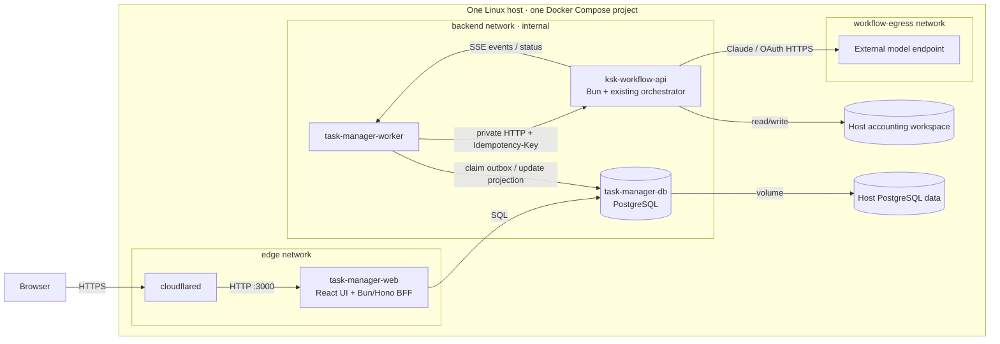
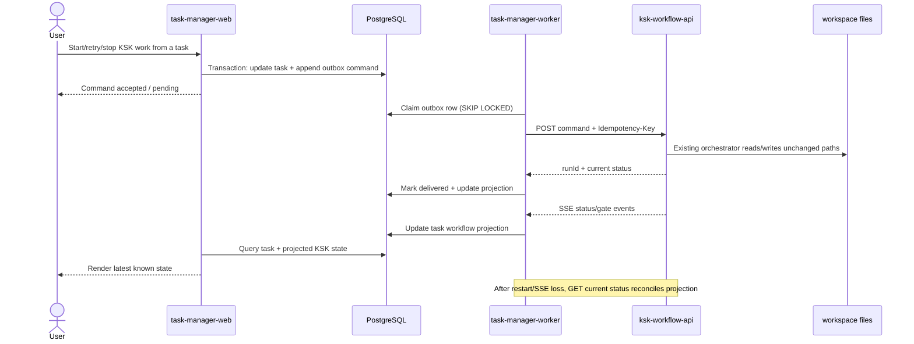

# Single-host Task Manager + KSK Workflow architecture

> **Superseded on 2026-08-06.** This five-service/PostgreSQL proposal is retained as
> decision history only. The authoritative architecture is
> `docs/plans/2026-08-06-keying-core-modular-monolith-plan.md`: one **Keying Core**
> process/container with embedded SQLite, the real workflow queue/monitor inside Core,
> and CLI/private HTTP/SSE adapters.

Status: superseded

Date: 2026-08-06
Scope: one Linux host, one Docker Compose project, public website only
Companion implementation plan: `docs/plans/2026-08-06-api-service-separation-plan.md`

## Decision

Run five containers in one Compose project:

1. `cloudflared` — the only public ingress.
2. `task-manager-web` — browser UI, session/auth boundary, Task Manager API/BFF.
3. `task-manager-worker` — durable integration worker between Task Manager and KSK.
4. `task-manager-db` — PostgreSQL for Task Manager-owned data and the outbox.
5. `ksk-workflow-api` — private KSK runner and the only writer to the accounting workspace.

The browser never calls `ksk-workflow-api` directly. The public hostname routes only
to `task-manager-web`. The workflow API has no published host port.

Use one Compose project, but do not combine these into one container. Separate
containers preserve failure boundaries, independent restarts, least-privilege mounts,
and a clear ownership boundary while retaining single-command operations.

## Container and network topology



### Networks

| Network | Members | Internet gateway | Purpose |
|---|---|---:|---|
| `edge` | `cloudflared`, `task-manager-web` | yes | Tunnel reaches the web service; tunnel can reach Cloudflare. |
| `backend` (`internal: true`) | web, worker, database, workflow API | no | Private service-to-service traffic and service-name DNS. |
| `workflow-egress` | workflow API only | yes | Allows Claude/OAuth calls without making the API public. |

`task-manager-web` is dual-homed on `edge` and `backend`.
`ksk-workflow-api` is dual-homed on `backend` and `workflow-egress`.
Do not use host networking. Do not publish PostgreSQL or workflow API ports.
An optional development-only web binding may use `127.0.0.1`, never `0.0.0.0`.

## Service responsibilities

| Service | Owns | Must not own |
|---|---|---|
| `cloudflared` | Public hostname routing to web | Application auth logic, API routing to KSK |
| `task-manager-web` | UI, user session, Task Manager commands/queries, controlled file-view BFF | Workflow execution, workspace writes |
| `task-manager-worker` | Outbox delivery, retries, idempotency, SSE subscription, reconciliation | Accounting truth, public HTTP traffic |
| `task-manager-db` | Users/teams/projects/tasks, workflow bindings, command outbox, status projection | KSK artifacts, KSK `run-state.yaml` |
| `ksk-workflow-api` | Workflow lifecycle, existing state machine/orchestrator, gates, workspace mutations | User/task management, public ingress |

The web and worker can be built from the same application image with different
entry commands. They remain separate runtime processes.

## Workspace mounts

Only `ksk-workflow-api` receives the accounting workspace and Claude credentials.
The web, worker, database, and tunnel must not mount the client workspace.

| Host source | Container target | Mode | Compatibility reason |
|---|---|---:|---|
| `${KSK_APP_WORKSPACE_ROOT_HOST}` | `/workspace` | `rw` | Preserves the current workspace root and all workflow-relative paths. |
| `${KSK_APP_SKILLS_HOST}` | `/workspace/.claude` | `ro` | Preserves the existing installed skills path without allowing mutation. |
| `${HOST_CLAUDE_DIR}` (currently the host user's `.claude`) | `/home/app/.claude` | `rw` | Claude refreshes credentials using temporary-file + rename; mount the directory, not an individual credentials file. |
| `${KSK_CLAUDE_JSON_HOST}` | `/home/app/.claude.json` | `rw` | Service-owned Claude runtime configuration. |
| named volume or `/srv/ksk-platform/task-manager-postgres` | `/var/lib/postgresql/data` | `rw` | Task Manager database persistence. |
| `/srv/ksk-platform/cloudflared` | `/etc/cloudflared` | `ro` | Tunnel configuration/credential material. |

Run the workflow container with a UID/GID that can write the host workspace. Never
mount `/var/run/docker.sock`. Put platform data outside client/accounting directories.

Recommended host layout:

```text
/srv/ksk-platform/
├── compose/                         # compose.yaml, env references
├── task-manager-postgres/           # or use a Docker named volume
├── workflow-runtime/
│   └── claude.json                  # mounted as /home/app/.claude.json
├── cloudflared/                     # tunnel config/credentials
└── backups/                         # DB backups and restore notes

~/Dropbox/สารบัญงานบัญชี_For Ton/     # existing workspace; unchanged
├── .claude/                         # existing installed skills; read-only in API
└── <client>/
    ├── CLIENT.md
    ├── coa.csv
    ├── coa_usage.json
    └── <month>/
        └── ข้อมูลระบบ/
            ├── _pages/
            ├── _segments/
            ├── _doc_groups/
            └── ตรวจทาน/
```

## Command and event flow



The PostgreSQL outbox is an integration delivery queue, not the workflow executor.
The KSK service retains its existing serialized in-process work queue and persists its
actual run state in the existing workspace. No Redis or RabbitMQ is required initially.

## Source-of-truth boundaries

| Fact | Authoritative owner | Cached/reference copy |
|---|---|---|
| Users, teams, projects, task assignment | Task Manager PostgreSQL | none |
| Requested workflow command and delivery state | Task Manager outbox | worker process memory only |
| Actual workflow state, gates, completion, accounting artifacts | KSK API + existing workspace files | Task Manager workflow projection |
| Review artifacts | Existing workspace paths exposed through controlled web BFF reads | Optional metadata projection |

Task Manager must not declare a workflow complete from its own task status. It displays
KSK's projected state and reconciles with `GET` after disconnects or restarts.

## API boundary and compatibility

Keep the existing external contract described in the companion plan:

- Commands: start, retry, stop/cancel where currently supported.
- Queries: current status, gate/status details, allowed review-file reads.
- Events: raw SSE workflow events; Task Manager translates them into its own projection.
- Every mutating command accepts an `Idempotency-Key`.
- Inputs remain client/month/source references rooted beneath `/workspace`.
- Outputs remain in the same client/month directories and keep the same filenames.
- API responses expose logical workspace-relative references, never arbitrary host paths.

Add contract fixtures for representative commands, status payloads, SSE events, and
workspace paths before changing process boundaries. Run old and extracted adapters
against the same fixtures to prove compatibility.

## Recommended stack

| Layer | Choice | Rationale |
|---|---|---|
| Runtime/language | Bun + TypeScript | Matches the current KSK runtime and enables shared contract types. |
| Task Manager HTTP/BFF | Hono | Small Bun-native routing layer with straightforward request-level tests. |
| Task Manager UI | React + Vite + TypeScript | Suitable for a richer multi-domain Task Manager while keeping UI deployment simple. |
| Database | PostgreSQL | Durable tasks, outbox, projections, transactions, and backups in one service. |
| Data access | Bun SQL with a thin typed repository | Keeps transactions explicit; avoid a heavy ORM until the domain stabilizes. |
| Async integration | PostgreSQL transactional outbox | Durable single-host command delivery without another broker. |
| Live updates | SSE | Fits one-way workflow progress and the existing event model; reconcile with GET. |
| Public ingress | Cloudflare Tunnel + Access | Publishes only the web hostname without opening inbound API ports. |
| Operations | Docker Compose, single replicas | Correct scale and operational complexity for one Linux machine. |

## Failure and restart behavior

| Failure | Expected behavior |
|---|---|
| Workflow API down | Task Manager remains usable; commands stay pending and retry later. |
| Worker down | Task management remains usable; the outbox preserves accepted commands. |
| Web down | An already-running KSK workflow continues. |
| PostgreSQL down | Existing KSK run continues; Task Manager is degraded until DB returns. |
| Tunnel down | Local services and workflows continue; only public access is unavailable. |
| SSE connection lost | Worker reconnects and reconciles from `GET` current status. |
| Host restarts | Compose restarts services; PostgreSQL volume and workspace files preserve state. |

Back up both PostgreSQL and the existing workspace. They contain different sources of
truth and must be restored as a documented pair, even though KSK artifacts are never
copied into the database.

## Implementation slices

1. Extract `ksk-workflow-api` while retaining the current orchestrator, state machine,
   inputs, outputs, workspace paths, and mount contract.
2. Add PostgreSQL schema for tasks, workflow bindings, status projections, and the
   transactional outbox.
3. Add the worker path for start/status/events/retry/stop with idempotency and
   reconciliation tests.
4. Add a KSK panel to Task Manager task detail, reading only the database projection.
5. Add controlled review-artifact reads through the web BFF; never expose a generic
   filesystem endpoint.
6. Move the public tunnel route to `task-manager-web` only and verify that the KSK API
   and PostgreSQL have no published ports.

## Acceptance checks

- A current representative client/month run produces byte-for-byte equivalent path
  names and contract-equivalent statuses before and after extraction.
- Only the workflow API can write the workspace; mount inspection proves this.
- Browser network traces show no direct calls to the workflow API.
- Replayed command keys do not create duplicate runs.
- Worker, web, database, workflow API, tunnel, and host restart drills match the table
  above.
- Public scanning can reach only the Task Manager hostname; private services are not
  bound to host interfaces.
- Backup and restore drills recover both Task Manager data and KSK run state.
